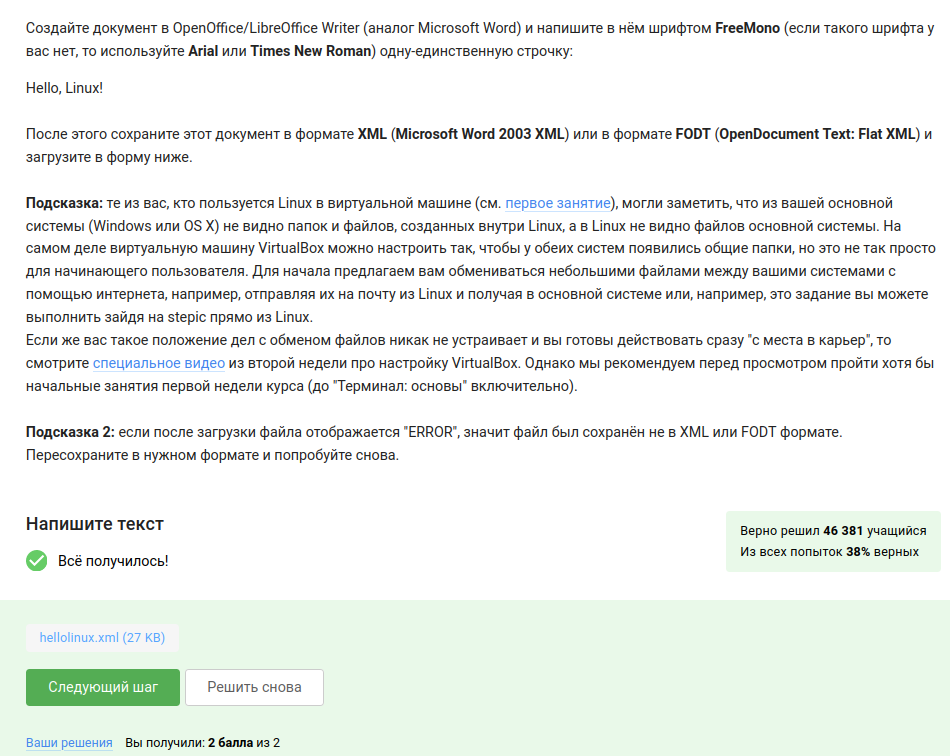
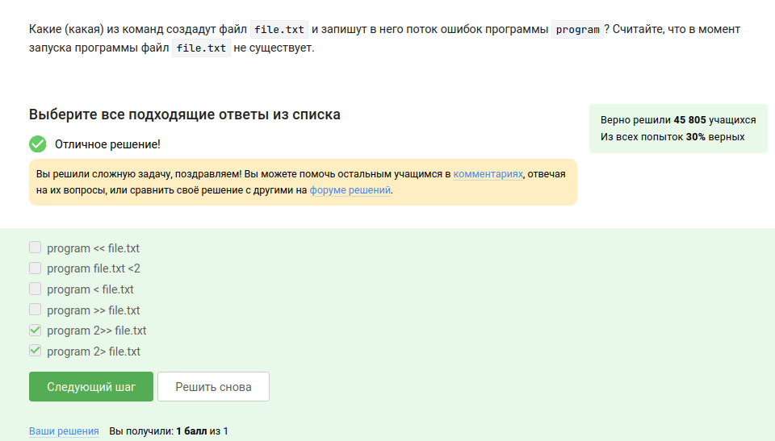
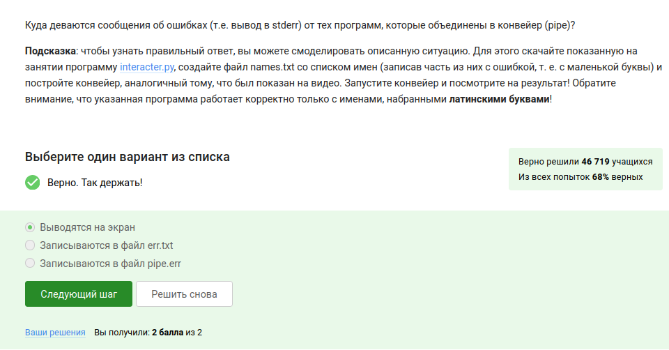
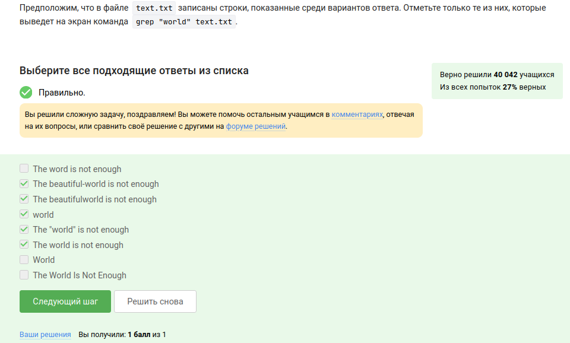
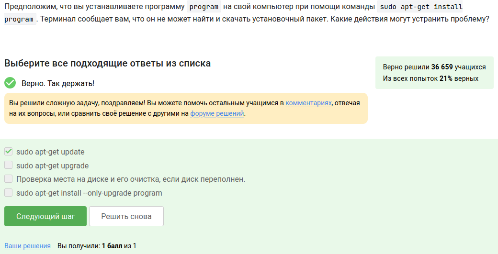
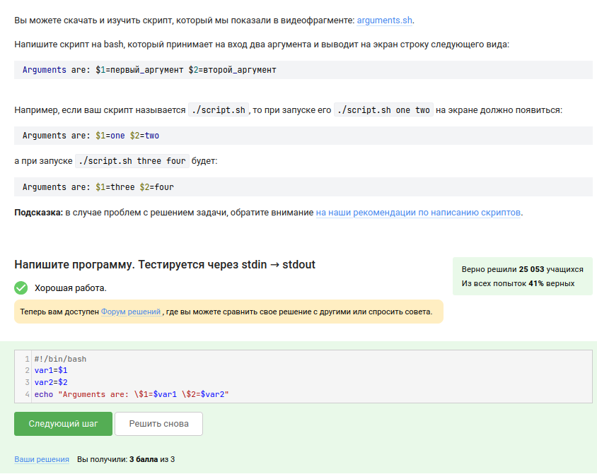

---
## Front matter
title: "Отчет о прохождении внешнего курса"
subtitle: "Введение, работа на сервере, продвинутые темы"
author: "Машков Илья Евгеньевич"

## Generic otions
lang: ru-RU
toc-title: "Содержание"

## Bibliography
bibliography: bib/cite.bib
csl: pandoc/csl/gost-r-7-0-5-2008-numeric.csl

## Pdf output format
toc: true # Table of contents
toc-depth: 2
lof: true # List of figures
lot: true # List of tables
fontsize: 12pt
linestretch: 1.5
papersize: a4
documentclass: scrreprt
## I18n polyglossia
polyglossia-lang:
  name: russian
  options:
	- spelling=modern
	- babelshorthands=true
polyglossia-otherlangs:
  name: english
## I18n babel
babel-lang: russian
babel-otherlangs: english
## Fonts
mainfont: PT Serif
romanfont: PT Serif
sansfont: PT Sans
monofont: PT Mono
mainfontoptions: Ligatures=TeX
romanfontoptions: Ligatures=TeX
sansfontoptions: Ligatures=TeX,Scale=MatchLowercase
monofontoptions: Scale=MatchLowercase,Scale=0.9
## Biblatex
biblatex: true
biblio-style: "gost-numeric"
biblatexoptions:
  - parentracker=true
  - backend=biber
  - hyperref=auto
  - language=auto
  - autolang=other*
  - citestyle=gost-numeric
## Pandoc-crossref LaTeX customization
figureTitle: "Рис."
tableTitle: "Таблица"
listingTitle: "Листинг"
lofTitle: "Список иллюстраций"
lotTitle: "Список таблиц"
lolTitle: "Листинги"
## Misc options
indent: true
header-includes:
  - \usepackage{indentfirst}
  - \usepackage{float} # keep figures where there are in the text
  - \floatplacement{figure}{H} # keep figures where there are in the text
---

# Цель работы

Ознакомиться с функционалом операционной системы Linux.

# Задание

Изучить информацию и пройти тестовые задания.

# Выполнение внешнего курса

## 1.Введение

Прочитав название курса, выбрал правильный ответ (рис. @fig:001).

{#fig:001 width=70%}

Прочитав введение в курс, выбрал правильные ответы (рис. @fig:002).

{#fig:002 width=70%}

Указал на каких системах уже рабтал (рис. @fig:003).

{#fig:003 width=70%}

Oracle VM VirtualBox — самое популярное в мире кросс-платформенное ПО для виртуализации с открытым кодом — позволяет разработчикам быстрее поставлять код за счет возможности запускать на одном устройстве несколько операционных систем. (рис. @fig:004).

{#fig:004 width=70%}

Уже запускал систему Linux в Virtual box. Причем пробовал разные дистрибутивы, такие как: Fedora, Kali (рис. @fig:005).

{#fig:005 width=70%}

Я создал документ word, выбрал определенный шрифт, и перед сохранением выбрал нужный формат, а после прикрепил к курсу (рис. @fig:006).

{#fig:006 width=70%}

Deb (сокр. от Debian) — расширение имён файлов «бинарных» пакетов для распространения и установки программного обеспечения в операционной системе проекта Debian и других, использующих систему управления пакетами dpkg (рис. @fig:007).

{#fig:007 width=70%}

У меня уже был установлен VLC media pleer, поэтому просто захожу в About и копирую фамилию разработчика (рис. @fig:008).

{#fig:008 width=70%}

Менеджер обновлений (Update Manager) — это программа для обновления установленного программного обеспечения в дистрибутивах ОС Linux, основанных на Debian или использующих систему управления пакетами APT (рис. @fig:009).

{#fig:009 width=70%}

Консоль(cmd) == Терминал. Ассоль - героиня литературного произведения, а термин - это определение (рис. @fig:010).

{#fig:010 width=70%}

Команда pwd - это очень простая утилита, которая позволяет вывести в терминал путь к текущей папке, причем регистр имеет значение (рис. @fig:011).

{#fig:011 width=70%}

Интерфейс командной строки Linux является регистрозависимым, поэтому, где буква А - строчная нам не подходит (рис. @fig:012).

{#fig:012 width=70%} 

Все возможные способы перехождения в нужную папку:
 1. ls ../Downloads
 2. ls ~/Downloads
 3. ls /home/bi/Downloads

{#fig:013 width=70%}

Чтобы удалить директорию можно использовать rm -r, а также rmdir. Разница между ними в том, что rm -r может удалять ещё и файлы и удаляет файлы находящиеся в папке (рис. @fig:014).

{#fig:014 width=70%}

Проверил в Virtual box (рис. @fig:015).

{#fig:015 width=70%}

& - это запуск в фоновом режиме (рис. @fig:016).

{#fig:016 width=70%}

Проверил в виртуальной машине (рис. @fig:017).

{#fig:017 width=70%}

По умолчанию входной поток связан с клавиатурой, а выходной поток и поток сообщений об ошибках направлены на терминал пользователя. Другими словами, вся выходная информация запущенной пользователем команды или программы, а также все сообщения об ошибках, выводятся в окно терминала, то есть на экран (рис. @fig:018).

{#fig:018 width=70%}

1. < file — использовать файл как источник данных для стандартного потока ввода.

2. > file — направить стандартный поток вывода в файл. Если файл не существует, он будет создан, если существует — перезаписан сверху.

3. 2> file — направить стандартный поток ошибок в файл. Если файл не существует, он будет создан, если существует — перезаписан сверху.

4. >>file — направить стандартный поток вывода в файл. Если файл не существует, он будет создан, если существует — данные будут дописаны к нему в конец.

5. 2>>file — направить стандартный поток ошибок в файл. Если файл не существует, он будет создан, если существует — данные будут дописаны к нему в конец.

6. &>file или >&file — направить стандартный поток вывода и стандартный поток ошибок в файл. Другая форма записи: >file 2>&1.

{#fig:019 width=70%}

cat names.txt | ./interacter.py | less - вывод на экран, если же добавить >err.txt, то тогда будет записывать в файл err.txt (рис. @fig:020).

{#fig:020 width=70%}

При выполнении команды происходят такие действия:
1. Скачивается файл в директорию /home/alex/Pictures
2. Из-за ключа -0 1.jpg, файл конвертируется в 1.jpg и размещается директории, в которой мы находимся, так как путь файла уже не указан, а указано только название - 1.jpg.

{#fig:021 width=70%}

-q
--quiet
   Turn off Wget's output. (рис. @fig:022).

{#fig:022 width=70%}

Опции команды wget:

1. -r, --recursive - Включить рекурсивную загрузку.
2. -l depth, --level=depth - Максимальная глубина рекурсивной загрузки depth. По умолчанию ее значение равно 5.
3. -A logfile --append-output=logfile - Дополнить logfile. Как и -o, только logfile не заменяется, а дополняется. Если logfile не существует, создается новый файл.

{#fig:023 width=70%}

gzip (сокращение от GNU Zip) — утилита сжатия и восстановления (декомпрессии) файлов, использующая алгоритм Deflate (рис. @fig:024).

{#fig:024 width=70%}

tar - архиватор. gzip - компрессор. zip - 2 в 1, архиватор и компрессор (рис. @fig:025).

{#fig:025 width=70%}

Создание выполняется с ключом c. j - Использование bzip2. f - архив в файловой системе (рис. @fig:026).

{#fig:026 width=70%}

`?` - один символ, `alexey` - из-за маленькой буквы. Файл должен быть `jpeg`, а не `jpg` (рис. @fig:027).

{#fig:027 width=70%}

Регистр важен, слово - `world`, а не `word` (рис. @fig:028).

{#fig:028 width=70%}

Решил на виртуальной машине (рис. @fig:029).

{#fig:029 width=70%}

А затем отправил файл со всеми строками, в которых было слово "love" (рис. @fig:030).

{#fig:030 width=70%}

## Работа на сервере

Удаленный сервер — это программный веб-сервер, к которому можно получить доступ через интернет. Он может принадлежать непосредственно компании и арендоваться у хостинг-провайдера в облаке, на виртуальных мощностях. Другие компьютеры подсоединяются к нему через службы удаленного доступа (RAS) (@fig:031).

{#fig:031 width=70%}

Только id_rsa.pub, поскольку это public key (@fig:032).

{#fig:032 width=70%}

The scp -r command in Linux is used to copy an entire directory and its contents (@fig:033).

{#fig:033 width=70%}

Проверяем интернет соединение, затем проверяем то, об существовании такой программы (@fig:034).

{#fig:034 width=70%}

Filezilla - cвободный многоязычный проект, посвящённый приложениям для FTP.
Проект включает в себя:
- отдельное приложение «FileZilla Client» (являющееся FTP-клиентом);
- «FileZilla Server» (FTP-сервер).
Приложения публикуются с открытым исходным кодом для Windows, macOS и Linux (@fig:035).

{#fig:035 width=70%}

1. Проверить, актуальность версии этой программы, ещё поможет попробовать другую версию программы
2. Настроить сервер, чтобы он поддерживал вывод информации на экран компьютера (@fig:036).

{#fig:0036 width=70%} 

{#fig:037 width=70%}

FastQC supports files in the following formats

FastQ (all quality encoding variants)
Casava FastQ files*
Colorspace FastQ
GZip compressed FastQ
SAM
BAM
SAM/BAM Mapped only (normally used for colorspace data) (@fig:038).

{#fig:038 width=70%}

-align - Do full multiple alignment (@fig:039).

{#fig:039 width=70%}

Комбинация Ctrl+С - завершает процесс, а комбинация Ctrl+Z - приостанавливает процесс (@fig:040).

{#fig:040 width=70%}

{#fig:041 width=70%}

kill — наиболее распространённый способ отправки сигналов процессам. Эта команда принимает два аргумента: номер или имя сигнала и PID процесса, который надо завершить.(@fig:042).

{#fig:042 width=70%}

Команда kill шлёт сигнал о завершении процесса. Но программа обрабатывает сигналы только когда она исполняется, пока она остановлена она не может обработать сигнал и приступит к его обработке только после продолжения работы (@fig:043).

{#fig:043 width=70%}

Приостановленная программа не потребляет ресурсы процессора компьютера (@fig:044).

{#fig:044 width=70%}

Приостановленная программа не потребляет ресурсы процессора компьютера. При этом, в оперативной памяти оно сохранится, поэтому оно будет занимать столько же оперативной памяти, сколько до постановки на паузу (@fig:045).

{#fig:045 width=70%}

Threads are an integral part of the process and cannot be killed outside it. There is the pthread_kill function but it only applies in the context of the thread itself. From the docs at the link:
Note that pthread_kill() only causes the signal to be handled in the context of the given thread; the signal action (termination or stopping) affects the process as a whole (@fig:046).

{#fig:046 width=70%}

{#fig:047 width=70%}

Программа:
``` bash
echo "306174 reads; of these:
  306174 (100.00%) were unpaired; of these:
    11 (0.00%) aligned 0 times
    305580 (99.81%) aligned exactly 1 time
    583 (0.19%) aligned >1 times
100.00% overall alignment rate" > bowtie.log
```

{#fig:048 width=70%}

{#fig:049 width=70%}

exit завершит работу tmux (@fig:050).

{#fig:050 width=70%}

Соединение с сервером прервется, а tmux будет продолжать свою работу на сервере (@fig:051).

{#fig:051 width=70%}

{#fig:052 width=70%}

Ctrl+b c - создать новое окно;

Ctrl+b 0-9 - открыть окно по его номеру;

Ctrl+b , - переименовать текущее окно;

Ctrl+b % - разделить текущую панель по горизонтали;

Ctrl+b " - разделить текущую панель по вертикали;

Ctrl+b стрелка - перейти на панель, находящуюся в стороне, куда указывает стрелка;

Ctrl+b Ctrl+стрелка - изменить размер текущей панели;

Ctrl+b o - перейти на следующую панель;

Ctrl+b ; - переключаться между текущей и предыдущей панелью;

Ctrl+b x - закрыть текущую панель;

Ctrl+b [ - войти в режим копирования (подробнее ниже);

Ctrl+b ] - вставить из внутреннего буфера обмена tmux;

Ctrl+b d - отключится от текущей сессии;

Ctrl+b : - открыть командную строку.

Ctrl+b w - выбрать окно из списка;

{#fig:053 width=70%}

{#fig:054 width=70%}

## Продвинутые темы

Клавиши:
- ZQ - выйти без сохранения
- :q! - выйти без сохранения
- ZZ - записать файл и выйти (если файл не изменяли, то записываться он не будет)
- :wq - записать файл и выйти
- :x - записать файл и выйти
- :w<CR> - записать файл
- :sav filename<CR> - "сохранить как"
- :w filename<CR> - "сохранить как"
- :w!<CR> - записать файл

{#fig:055 width=70%}

`Strange_  TEXT  is_here. 2=2 YES!`

Точка считается "маленьким словом", так что всего их 9:
`Strange_`, `is_here`, `.`, `2`, `=`, `2`, `!` и `два лишних пробела` (@fig:056).

{#fig:056 width=70%} 

- $ — в конец текущей строки;
- w — на слово вправо;
- b — на слово влево;
- i — начать ввод перед курсором;
- p — вставка содержимого неименнованного буфера под курсором;
- P — вставка содержимого неименованного буфера перед курсором;
- yy (также Y) — копирование текущей строки в неименованный буфер;
- y<число>y — копирование числа строк начиная с текущей в неименованный буфер;

{#fig:057 width=70%}

{#fig:058 width=70%}

Команда $ — в конец текущей строки, W - до пробела вправо - то есть, перемещение.

Нажать Esc достаточно один раз, но да ладно.

Надпись visual - горит.

d — используется совместно с командами перемещения. Удаляет символы с текущего положения курсора до положения после ввода команды перемещения.(@fig:059).

yy (также Y) — копирование текущей строки в буфер;

{#fig:059 width=70%}

{#fig:060 width=70%}

`/home/bi/file1.txt` - так как в этой директории мы создаем новый файл, а уже после его создания мы переходим в другую папку (@fig:061).

{#fig:061 width=70%}

1. НЕ МОЖЕТ НАЧИНАТЬСЯ С ЦИФРЫ, но может начинаться с символа;
2. Регистр букв значения не имеет;
3. Точек быть не может.

Все вышеперечисленные пункты относятся к заданию 8 (@fig:062).

{#fig:062 width=70%}

Программа:
 
``` bash
#!/bin/bash
var1=$1
var2=$2
echo "Arguments are: \$1=$var1 \$2=$var2"
```

{#fig:063 width=70%}

- $0 #имя скрипта;
- z <string> # string empty;
- n <string> # string not empty;
- eq, (==)    # равно;
- ne, (!=)    # не равно;
- lt, (<)    # меньше;
- le,         # меньше или равно;
- gt, (>)    # больше;
- ge,         # больше или равно;
- e <path>    # путь существует;
- f <path>    # это файл;
- d <path>    # это директория;
- s <path>    # разм файла больше 0;
- x <path>    # файл исполняемый (@fig:064).        

{#fig:064 width=70%} 

- $0 #имя скрипта;
- z <string> # string empty;
- n <string> # string not empty;
- eq, (==)    # равно;
- ne, (!=)    # не равно;
- lt, (<)    # меньше;
- le,         # меньше или равно;
- gt, (>)    # больше;
- ge,         # больше или равно;
- e <path>    # путь существует;
- f <path>    # это файл;
- d <path>    # это директория;
- s <path>    # разм файла больше 0;
- x <path>    # файл исполняемый (@fig:065).

{#fig:065 width=70%}

Программа: 
``` bash
#!/bin/bash
if [[ $1 -eq 1 ]]; 
then
    echo "$1 student"
elif [[ $1 -gt 1 && $1 -le 4 ]]; 
then
    echo "$1 students"
elif [[ $1 -ge 5 ]]; 
then
    echo "A lot of students"
else
    echo "No students"
fi
```

{#fig:066 width=70%}

{#fig:067 width=70%}

Программа: 
```bash
while [[ 1==1 ]]
do
        group=""
        echo "enter your name:"
        read name
        if [[ -z $name ]]
        then
                break
        fi
        echo "enter your age:"
        read age
        if [[ $age -eq 0 ]]
        then
                break
        fi
        if [[ $age -le 16 ]]
        then
                group="child"
        elif [[ $age -le 25 ]]
        then
                group="youth"
        else
                group="adult"
        fi
        echo "$name, your group is $group"
done
echo "bye"
```

{#fig:068 width=70%}

1) a и $a это одно и то же;

2) a += b это то же самое что и a = a + b, но "+=" != "=+";

3) если выражение НЕ в скобках, с пробелами работать не будет. (let a=a+b - ок; let a = a + b - не ок) (@fig:069).

{#fig:069 width=70%}

Выведет путь до директории, в которую мы перешли, так как "```pwd```" - это команда (@fig:070).

{#fig:070 width=70%}

{#fig:071 width=70%}

Первая переменная локальная равная пустой строке, вторая переменная - это сумма арифметической прогрессии от 1 до 10, равна 55, но при умножении на 2 даст 110 (@fig:072).

{#fig:072 width=70%}

Программа:

``` bash
while [ true ] 
do
    read n1 n2
if [ -z $n1 ]; then
    echo "bye"
    break
else
    gcd () {
    remainder=1
    if [ $n2 -eq 0 ]
    then
    echo "bye"
    fi
    while [ $remainder -ne 0 ]
    do
    remainder=$((n1%n2))
    n1=$n2
    n2=$remainder
    done
    }
    gcd $1 $2
    echo "GCD is $n1" 
fi
done
```

{#fig:073 width=70%}

Программа:
```bash
# put your shell (bash) code here
#!/bin/bash
while [[ True ]]
do
  read birinchi amal ikkinchi
  if [[ $birinchi == "exit" ]]
  then
    echo "bye"
    break
  elif [[ "$birinchi" =~ "^[0-9]+$" && "$ikkinchi" =~ "^[0-9]+$" ]]
  then
    echo "error"
    break
  else
    case $amal in
"+") let "result = birinchi + ikkinchi";;
"-") let "result = birinchi - ikkinchi";;
"/") let "result = birinchi / ikkinchi";;
"*") let "result = birinchi * ikkinchi";;
"%") let "result = birinchi % ikkinchi";;
"**") let "result = birinchi ** ikkinchi";;
*) echo "error" ; break ;;
    esac
    echo "$result"
  fi
done
```

{#fig:074 width=70%}

- iname ищет без учета регистра, а -name в точности как в запросе (@fig:075).

{#fig:075 width=70%}

find - путь; -name - образец
проверяет на соответствие образцу только собственно имя файла.
Bash - Выделить код
1 find - путь; -path - образец
проверяет на соответствие образцу полное имя файла с путём.
То есть, для файла /home/user/test на соответствие образцу будет проверяться:

- для -name -- только "test"
- для -path -- "/home/user/test"

Причём, для -path проверяется строка целиком, без учета деления на каталоги (@fig:076).

{#fig:076 width=70%}


Главное понимать что текущий каталог - это depth=1, а остальное считается просто:

/home/bi   -> depth=1

/home/bi/dir1   -> depth=2

/home/bi/dir1/dir2   -> depth=3 (@fig:077).

{#fig:077 width=70%}

{#fig:078 width=70%}

[xklXKL] - Первые буквы.
[uU]buntu$ - Последние буквы.

{#fig:079 width=70%}

The -n option disables the automatic printing, which means the lines you don't specifically tell it to print do not get printed, and lines you do explicitly tell it to print (e.g. with p) get printed only once (@fig:080).

{#fig:080 width=70%}

аббревиатура ABBA отличается от двух других аббревиатур тем, что справа он неё стоит запятая без пробела: "ABBA,". 

При этом по условию аббревиатура должна выглядеть как [ XX ] или [ XXX ] (и ещё больше X). Следовательно, для этой проверки надо добавить пробел квадратными скобками [ ] слева и, соответственно, с права (@fig:081).

{#fig:081 width=70%}

-persist lets plot windows survive after main gnuplot program exits (@fig:082).

{#fig:082 width=70%}

`plot 'data.csv' using 1:2` даст ошибку:

`warning: Skipping data file with no valid points ^ x range is invalid`

Скорее всего причиной такого поведения является тот факт, что формат CSV содержит строки, где столбцы разделены запятой? Содержимое файла:

```
1,21
2,22
3,23
4,24
5,25
6,26
7,27
8,28
9,29
10,30
```

{#fig:083 width=70%}

Сначала идет команда установки подписей, а потом в скобках ПОДПИСЬ пробел ПЕРЕМЕННАЯ С КООРДИНАТОЙ запятая повторяется это количество раз соответствующее числу переменных, и без запятой в случае с последней переменной), а ПОДПИСЬ в свою очередь получается конкатенацией ТЕКСТА ИЗ ЗАДАНИЯ и ПЕРЕМЕННОЙ С КООРДИНАТОЙ, например конкатенируем имя IVAN и переменную Y (@fig:084):
"IVAN".Y

{#fig:084 width=70%}


Программа (@fig:085):
```
a=a+1
zrot=(zrot+350)%360
set view xrot,zrot
splot -x**2-y**2
pause 0.1
if (a<50) reread
```

{#fig:085 width=70%}

{#fig:086 width=70%}

- r - чтение;
- w - запись;
- x - выполнение;
- s - выполнение  от имени суперпользователя (дополнительный);
- u - владелец файла;
- g - группа файла;
- o - все остальные пользователи;
- 0 - никаких прав;
- 1 - только выполнение;
- 2 - только запись;
- 3 - выполнение и запись;
- 4 -  только чтение;
- 5 - чтение и выполнение;
- 6 - чтение и запись;
- 7 - чтение запись и выполнение (@fig:087).

{#fig:087 width=70%} 

- wc -l <filename> вывести количество строк;
- wc -c <filename> вывести количество байт;
- wc -m <filename> вывести количество символов;
- wc -L <filename> вывести длину самой длинной строки;
- wc -w <filename> вывести количество слов (@fig:088).

{#fig:088 width=70%}

- a, --all - выводить размер для всех файлов, а не только для директорий, по умолчанию размер выводится только для папок;
- B, --block-size - указать единицы вывода размера, доступно: K,M,G,T,P,E,Z,Y для 1024 и KB, MB и так далее для 1000;
- c, --total - выводить в конце общий размер всех папок;
- d, --max-depth - максимальная глубина вложенности директорий;
- h, --human-readable - выводить размер в единицах измерения удобных для человека;
- --inodes - выводить информацию об использованию inode;
- L, --dereference - следовать по всем символическим ссылкам;
- l, --count-links - учитывать размер файла несколько раз для жестких ссылок;
- P, --no-dereference - не следовать по символическим ссылкам, это поведение используется по умолчанию;
- S, --separate-dirs - не включать размер подпапок в размер папки;
- -si - выводить размер файлов и папок в системе си, используется 1000 вместо 1024;
- s, --summarize - выводить только общий размер;
- t, --threshold - не учитывать файлы и папки с размером меньше указанного;
- --time - отображать время последней модификации для файла или папки, вместо времени модификации можно выводить такие метки: atime, access, use, ctime;
- X, --exclude - исключить файлы из подсчёта;
- x, --one-file-system - пропускать примонтированные файловые системы;
- --version - вывести версию утилиты (@fig:089).

{#fig:089 width=70%}

Команда создает три директории от dir1 до dir3 (@fig:090).

{#fig:090 width=70%}

# Вывод

При выполнении внешнего курса я освежил в памяти первые этапы ознакомления с Linux (установка линукса на виртуальную машину, основы работы с терминалом, запуск исполняеемых файлов, скачивание файлов и поисковые операции), повторил основы работы с сервером и приобрёл навыки работы с bash-программированием.

В подверждении прохождения данного курса прикрепляю свой сертификат (@fig:091):

{#fig:091 width=70%}

# Список литературы{.unnumbered}

1. [Внешний курс](https://stepik.org/course/73/syllabus)

2. [Сертификат](https://stepik.org/cert/2468445)

