---
## Front matter
title: "Лабораторная работа №4"
subtitle: "Операционные системы"
author: "Машков Илья Евгеньевич"

## Generic otions
lang: ru-RU
toc-title: "Содержание"

## Bibliography
bibliography: bib/cite.bib
csl: pandoc/csl/gost-r-7-0-5-2008-numeric.csl

## Pdf output format
toc: true # Table of contents
toc-depth: 2
lof: true # List of figures
lot: true # List of tables
fontsize: 12pt
linestretch: 1.5
papersize: a4
documentclass: scrreprt
## I18n polyglossia
polyglossia-lang:
  name: russian
  options:
	- spelling=modern
	- babelshorthands=true
polyglossia-otherlangs:
  name: english
## I18n babel
babel-lang: russian
babel-otherlangs: english
## Fonts
mainfont: PT Serif
romanfont: PT Serif
sansfont: PT Sans
monofont: PT Mono
mainfontoptions: Ligatures=TeX
romanfontoptions: Ligatures=TeX
sansfontoptions: Ligatures=TeX,Scale=MatchLowercase
monofontoptions: Scale=MatchLowercase,Scale=0.9
## Biblatex
biblatex: true
biblio-style: "gost-numeric"
biblatexoptions:
  - parentracker=true
  - backend=biber
  - hyperref=auto
  - language=auto
  - autolang=other*
  - citestyle=gost-numeric
## Pandoc-crossref LaTeX customization
figureTitle: "Рис."
tableTitle: "Таблица"
listingTitle: "Листинг"
lofTitle: "Список иллюстраций"
lotTitle: "Список таблиц"
lolTitle: "Листинги"
## Misc options
indent: true
header-includes:
  - \usepackage{indentfirst}
  - \usepackage{float} # keep figures where there are in the text
  - \floatplacement{figure}{H} # keep figures where there are in the text
---

# Цель работы

Получение навыков правильной работы с репозиториями git.

# Задание

1. Выполнить работу для тестового репозитория.
2. Преобразовать рабочий репозиторий в репозиторий с git-flow и conventional commits.

# Выполнение лабораторной работы

## Установка программного обеспечения

### Установка git-flow

Для начала требуется установить **git-flow** (рис. [-@fig:001]).

{#fig:001 width=70%}

## Установка Node.js

Затем устанавливаю **node.js** (рис. [-@fig:002]).

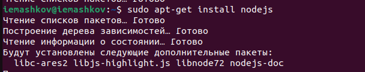{#fig:002 width=70%}

Также понадобится pnpm, с которым возникли проблемы, поэтому я устанавливал его через **wget** (рис. [-@fig:003]).

{#fig:003 width=70%}

## Настройка Node.js

Далее провожу настройку Node.js. Запускаю **pnpm setup**, затем использую команду **source ~/.bashrc**, чтобы перелогиниться (рис. [-@fig:004]).

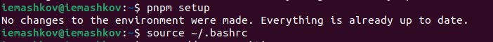{#fig:004 width=70%}

## Общепринятые коммиты

1. Добавляю с помощью команды **pnpm add -g** коммит **commitizen**, чтобы эта программа помогала формировать коммиты (рис. [-@fig:005]).

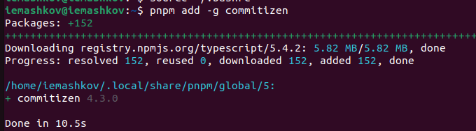{#fig:005 width=70%}

2. Далее, используя ту же команду устанавливаю **standart-changelog**, который будет использоваться для создания логов (рис. [-@fig:006]).

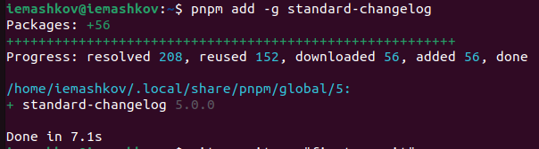{#fig:006 width=70%}

3. Теперь мне нужно создать репозиторий для дальнейшей работы. Для этого мне нужно клонировать этот репозиторий (рис. [-@fig:007]).

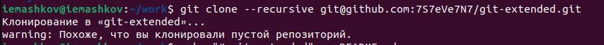{#fig:007 width=70%}

Затем создать файл, чтобы наш репозиторий не был пуст (рис. [-@fig:008]).

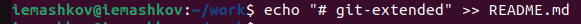{#fig:008 width=70%}

Инициализирую репозиторий (рис. [-@fig:009]).

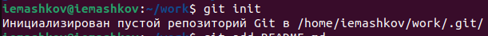{#fig:009 width=70%}

Теперь добавляю этот файл в список тех, которые я отправлю на сервер (рис. [-@fig:010]).

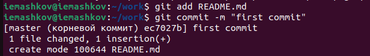{#fig:010 width=70%}

И, наконец, отправляю мой первый коммит на сервер (рис. [-@fig:011]).

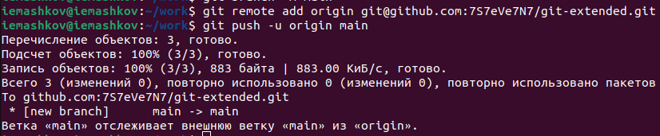{#fig:011 width=70%}

4. Дальше необходимо конфигурировать общепринятые коммиты. Для этого мне надо прописать команду **pnpm init**, чтобы создать конфигурационный файл (рис. [-@fig:012]).

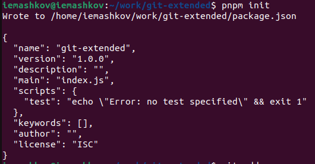{#fig:012 width=70%}

Конфигурирую формат коммитов в файле (рис. [-@fig:013]).
 
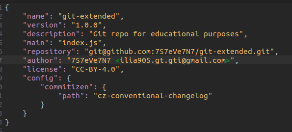{#fig:013 width=70%}

Добавляю новый файл и выполняю коммит (рис. [-@fig:014]).

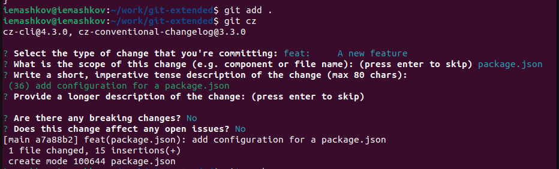{#fig:014 width=70%}

Затем отправляю это на сервер (рис. [-@fig:015]).

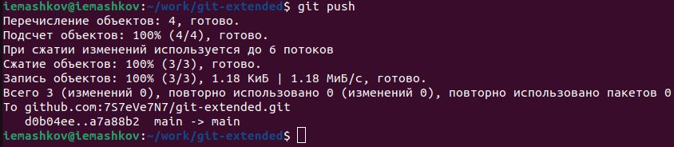{#fig:015 width=70%}

## Конфигурация git flow

Инициализирую **git flow**, указывая префиксом для ярлыков значение **v** (рис. [-@fig:016]).

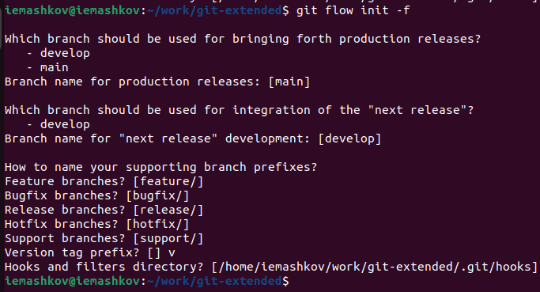{#fig:016 width=70%}

Проверяю, что нахожусь в ветке **develop** (рис. [-@fig:017]).

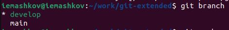{#fig:017 width=70%}

Загружаю весь репозиторий в хранилище командой **git push --all** (рис. [-@fig:018]).

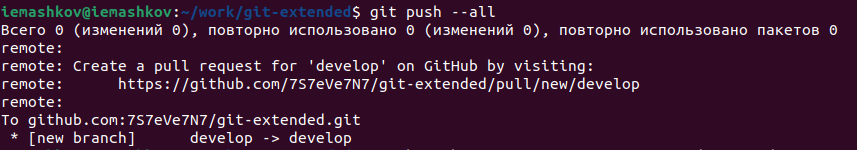{#fig:018 width=70%}

Теперь устанавливаю внешнюю ветку вышестоящей для этой (рис. [-@fig:019]).

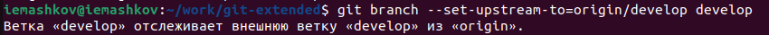{#fig:019 width=70%}

Создаю релиз с версией **1.0.0** (рис. [-@fig:020]).

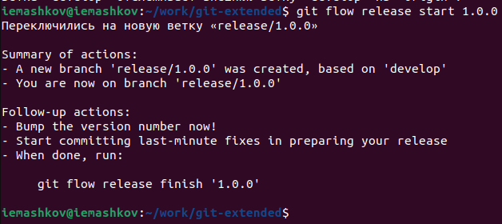{#fig:020 width=70%}

Создаю журнал изменений (рис. [-@fig:021]).

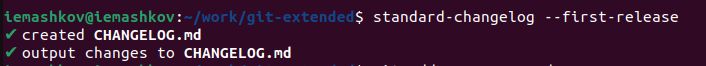{#fig:021 width=70%}

Добавляю этот журнал в индекс (рис. [-@fig:022]).

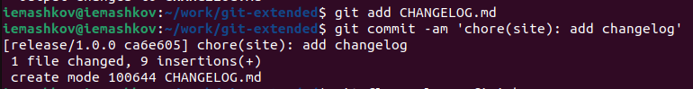{#fig:022 width=70%}

Заливаю релизную ветку в основную (рис. [-@fig:023]).

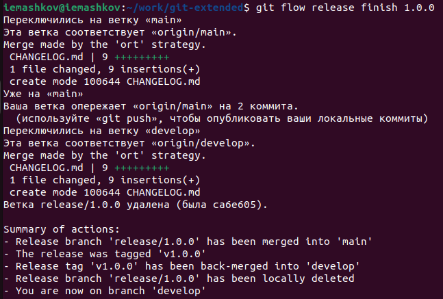{#fig:023 width=70%}

Затем отправляю данные на сервер (рис. [-@fig:024]).

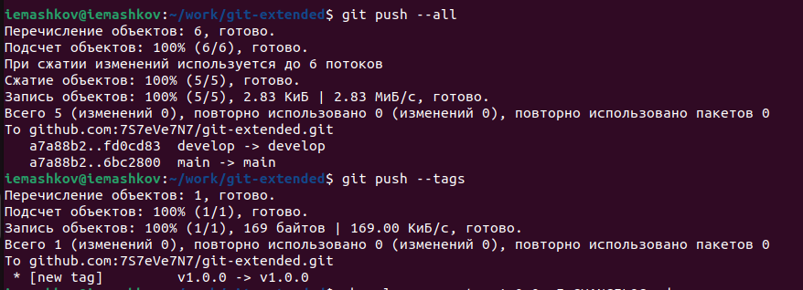{#fig:024 width=70%}

Создаю релиз на github, используя установленные утилиты (рис. [-@fig:025]).

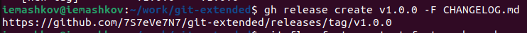{#fig:025 width=70%}

## Работа с репозиторием git

1. Создаю ветку для новой функциональности (рис. [-@fig:026]).

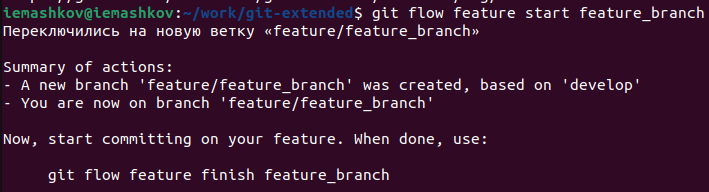{#fig:026 width=70%}

Далее объединяю эту ветку с ветками **feature_branch** и **develop** с помощью команды **git flow feature finish feature_branch**

2. Создаю релиз с версией **1.2.3** (рис. [-@fig:027]).

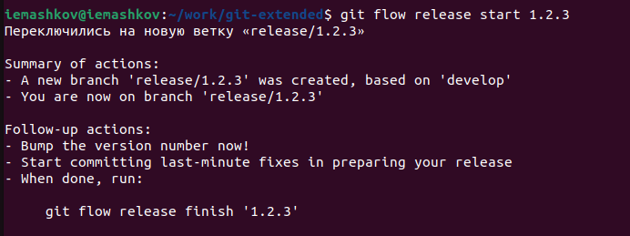{#fig:027 width=70%}

Обновляю номер версии в файле **package.json** (рис. [-@fig:028]).

{#fig:028 width=70%}

Создаю журнал изменений (рис. [-@fig:029]).

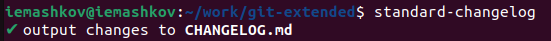{#fig:029 width=70%}

И добавляю его в индекс (рис. [-@fig:030]).

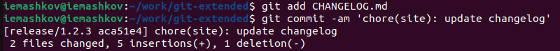{#fig:030 width=70%}

Заливаю релизную ветку в основную (рис. [-@fig:031]).

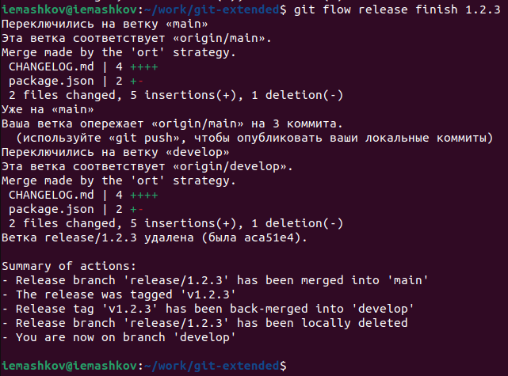{#fig:031 width=70%}

Отправляю данные на github (рис. [-@fig:032]).

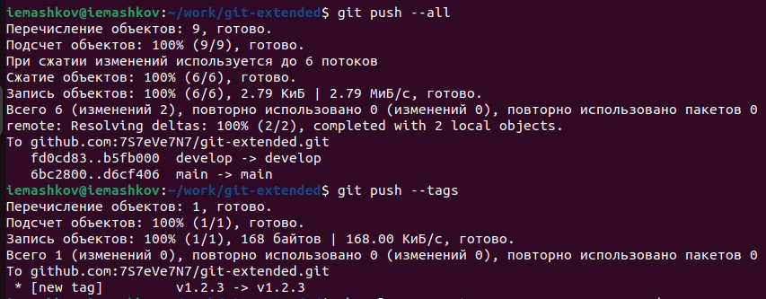{#fig:032 width=70%}

Создаю релиз на github с комментарием из журнала изменений (рис. [-@fig:033]).

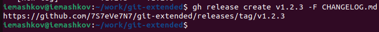{#fig:033 width=70%}

# Выводы

При выполнении лабораторной работы я получил навыки для правильной работы с репозиториями git.

# Список литературы{.unnumbered}

[Операционные системы](https://esystem.rudn.ru/mod/page/view.php?id=1098794&forceview=1)
