---
## Front matter
title: "Лабораторная работа №5"
subtitle: "Операционные системы"
author: "Машков Илья Евгеньевич"

## Generic otions
lang: ru-RU
toc-title: "Содержание"

## Bibliography
bibliography: bib/cite.bib
csl: pandoc/csl/gost-r-7-0-5-2008-numeric.csl

## Pdf output format
toc: true # Table of contents
toc-depth: 2
lof: true # List of figures
lot: true # List of tables
fontsize: 12pt
linestretch: 1.5
papersize: a4
documentclass: scrreprt
## I18n polyglossia
polyglossia-lang:
  name: russian
  options:
	- spelling=modern
	- babelshorthands=true
polyglossia-otherlangs:
  name: english
## I18n babel
babel-lang: russian
babel-otherlangs: english
## Fonts
mainfont: PT Serif
romanfont: PT Serif
sansfont: PT Sans
monofont: PT Mono
mainfontoptions: Ligatures=TeX
romanfontoptions: Ligatures=TeX
sansfontoptions: Ligatures=TeX,Scale=MatchLowercase
monofontoptions: Scale=MatchLowercase,Scale=0.9
## Biblatex
biblatex: true
biblio-style: "gost-numeric"
biblatexoptions:
  - parentracker=true
  - backend=biber
  - hyperref=auto
  - language=auto
  - autolang=other*
  - citestyle=gost-numeric
## Pandoc-crossref LaTeX customization
figureTitle: "Рис."
tableTitle: "Таблица"
listingTitle: "Листинг"
lofTitle: "Список иллюстраций"
lolTitle: "Листинги"
## Misc options
indent: true
header-includes:
  - \usepackage{indentfirst}
  - \usepackage{float} # keep figures where there are in the text
  - \floatplacement{figure}{H} # keep figures where there are in the text
---

# Цель работы

Получение навыков наастройки рабочей среды.

# Задание

1. Выполнение лабораторной работы.

# Выполнение лабораторной работы

## Менеджер паролей pass

### Установка 

Для начала требуется установить **pass** (рис. [-@fig:001]).

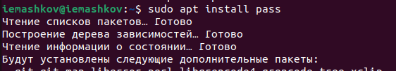{#fig:001 width=70%}

Затем устанавливаю **gopass** (рис. [-@fig:002]).

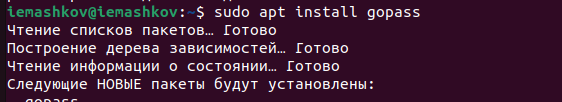{#fig:002 width=70%}

### Настройка

#### GPG ключи

Теперь займёмся настройкой. В методичке указано, что сначала надо проверить список ключей, но я решил сначала их сгенерировать (рис. [-@fig:003]).

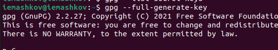{#fig:003 width=70}

А теперь проверяю список ключей (рис. [-@fig:004]).

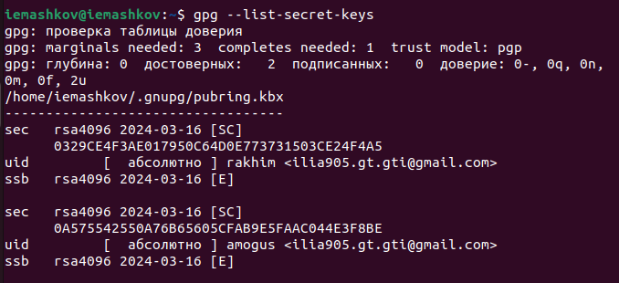{#fig:004 width=70%}

#### Инициализация хранилища

Инициализирую хранилище и создаю структуру git (рис. [-@fig:005]).

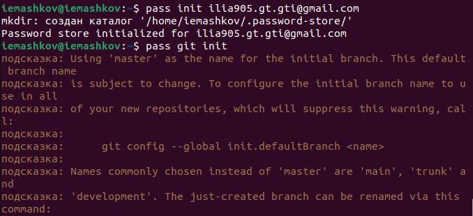{#fig:005 width=70%}

Затем задаю адрес репозитория на хостинге (рис. [-@fig:006]).

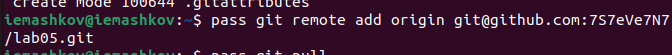{#fig:006 width=70%}

Теперь синхронизирую репозиторий (рис. [-@fig:007]).

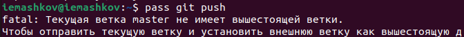{#fig:007 width=70%}

#### Прямые изменения

Т.к. отслеживаются только изменения, сделанные через **pass** или **gopass**, нам надо вручную закоммитить их и выложить (рис. [-@fig:008]).

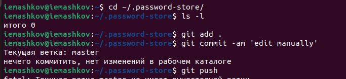{#fig:008 width=70%}

Затем проверить статус синхронизации (рис. [-@fig:009]).

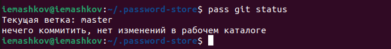{#fig:009 width=70%}

### Настройка интерфейса с браузером 

Добавляю плагин для браузера FireFox, после чего устанавливаю интерфейс для взаимодействия с браузером (рис. [-@fig:010]).

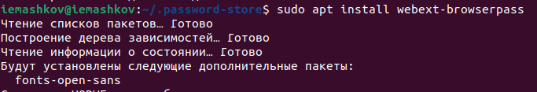{#fig:010 width=70%}

### Сохранение пароля

Выполняю команду **pass insert** (рис. [-@fig:011]).

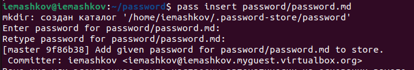{#fig:011 width=70%}

Дальше отображаю пароль для указанного имени файла (рис. [-@fig:012]).

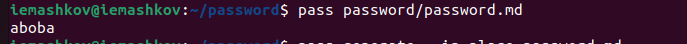{#fig:012 width=70%}

И заменяю существующий (рис. [-@fig:013]).
 
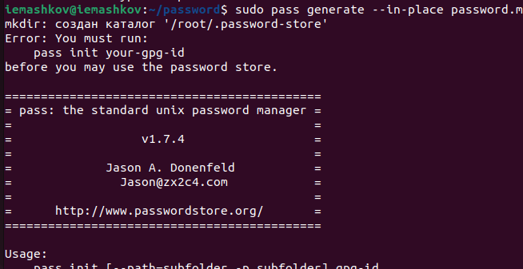{#fig:013 width=70%}

### Управление файлами конфигурации

#### Дополнительное программное обеспечение

Устанавливаю дополнительное программное обеспечение (рис. [-@fig:014]).

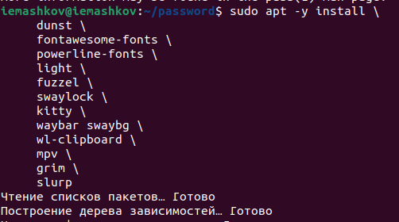{#fig:014 width=70%}

Устанавливаю шрифты (рис. [-@fig:015]).

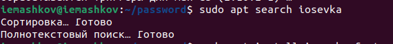{#fig:015 width=70%}

#### Установка

Устанавливаю бинарный файл, который определит архитектуру процессора и ОС, затем установит необходимый файл (рис. [-@fig:017]).

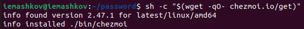{#fig:017 width=70%}

#### Создание собственного репозитория с помощью утилит

Создаю свой репозиторий на основе шаблона (рис. [-@fig:018]).

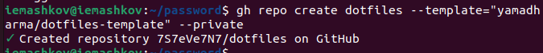{#fig:018 width=70%}

#### Подключение репозитория к своей системе

Инициализирую **chezmoi** с моим репозиторием **dotfiles** (рис. [-@fig:019]).

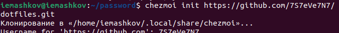{#fig:019 width=70%}

Проверяю изменения внёс **chezmoi** в домашний каталог (рис. [-@fig:020]).

{#fig:020 width=70%}

Принимаю эти изменения (рис. [-@fig:021]).

{#fig:021 width=70%}

Получаю и применяю последние изменения из моего репозитория (рис. [-@fig:022]).

{#fig:022 width=70%}

#### Ежедневные операции с chezmoi

Извлекаю последние изменения из репозитория, чтобы посмотреть изменения в файле (рис. [-@fig:023]).

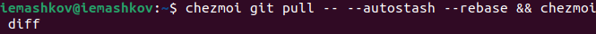{#fig:023 width=70%}

Чтобы включить автоматическую фиксацию изменений и отправку их в репозиторий, мне надо перейти в файл конфигурации и добить пару строк (рис. [-@fig:024]).

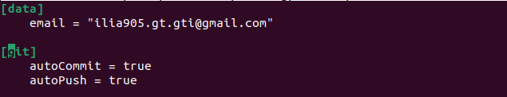{#fig:024 width=70%}

# Выводы

При выполнении лабораторной работы я получил навыки для настройки рабочей среды.

# Список литературы{.unnumbered}

[Операционные системы](https://esystem.rudn.ru/mod/page/view.php?id=1098796#org2695679)
