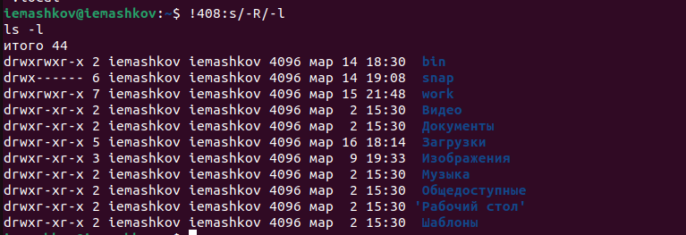

---
## Front matter
title: "Лабораторная работа №6"
subtitle: "Операционные системы"
author: "Машков Илья Евгеньевич"

## Generic otions
lang: ru-RU
toc-title: "Содержание"

## Bibliography
bibliography: bib/cite.bib
csl: pandoc/csl/gost-r-7-0-5-2008-numeric.csl

## Pdf output format
toc: true # Table of contents
toc-depth: 2
lof: true # List of figures
lot: true # List of tables
fontsize: 12pt
linestretch: 1.5
papersize: a4
documentclass: scrreprt
## I18n polyglossia
polyglossia-lang:
  name: russian
  options:
	- spelling=modern
	- babelshorthands=true
polyglossia-otherlangs:
  name: english
## I18n babel
babel-lang: russian
babel-otherlangs: english
## Fonts
mainfont: PT Serif
romanfont: PT Serif
sansfont: PT Sans
monofont: PT Mono
mainfontoptions: Ligatures=TeX
romanfontoptions: Ligatures=TeX
sansfontoptions: Ligatures=TeX,Scale=MatchLowercase
monofontoptions: Scale=MatchLowercase,Scale=0.9
## Biblatex
biblatex: true
biblio-style: "gost-numeric"
biblatexoptions:
  - parentracker=true
  - backend=biber
  - hyperref=auto
  - language=auto
  - autolang=other*
  - citestyle=gost-numeric
## Pandoc-crossref LaTeX customization
figureTitle: "Рис."
tableTitle: "Таблица"
listingTitle: "Листинг"
lofTitle: "Список иллюстраций"
lolTitle: "Листинги"
## Misc options
indent: true
header-includes:
  - \usepackage{indentfirst}
  - \usepackage{float} # keep figures where there are in the text
  - \floatplacement{figure}{H} # keep figures where there are in the text
---

# Цель работы

Приобретение практических навыков взаимодействия пользователя с системой посредством командной строки

# Задание

1. Определите полное имя вашего домашнего каталога. Далее относительно этого каталога будут выполняться последующие упражнения.
2. Выполните следующие действия:
 2.1. Перейдите в каталог /tmp.
 2.2. Выведите на экран содержимое каталога /tmp. Для этого используйте команду ls с различными опциями. Поясните разницу в выводимой на экран информации.
 2.3. Определите, есть ли в каталоге /var/spool подкаталог с именем cron?
 2.4. Перейдите в Ваш домашний каталог и выведите на экран его содержимое. Определите, кто является владельцем файлов и подкаталогов?
3. Выполните следующие действия:
 3.1. В домашнем каталоге создайте новый каталог с именем newdir.
 3.2. В каталоге ~/newdir создайте новый каталог с именем morefun.
 3.3. В домашнем каталоге создайте одной командой три новых каталога с именами letters, memos, misk. Затем удалите эти каталоги одной командой.
 3.4. Попробуйте удалить ранее созданный каталог ~/newdir командой rm. Проверьте, был ли каталог удалён.
 3.5. Удалите каталог ~/newdir/morefun из домашнего каталога. Проверьте, был ли каталог удалён.
4. С помощью команды man определите, какую опцию команды ls нужно использовать для просмотра содержимое не только указанного каталога, но и подкаталогов, входящих в него.
5. С помощью команды man определите набор опций команды ls, позволяющий отсортировать по времени последнего изменения выводимый список содержимого каталога с развёрнутым описанием файлов.
6. Используйте команду man для просмотра описания следующих команд: cd, pwd, mkdir, rmdir, rm. Поясните основные опции этих команд.
7. Используя информацию, полученную при помощи команды history, выполните модификацию и исполнение нескольких команд из буфера команд.

# Выполнение лабораторной работы

## 1. Определите полное имя вашего домашнего каталога. Далее относительно этого каталога будут выполняться последующие упражнения

Определяю полное имя своего домашнего каталога с помощью команды **pwd** (рис. [-@fig:001]).

{#fig:001 width=70%}

## 2. Список заданий №1

**2.1.** Перехожу в каталог **/tmp** и вывожу его содержимое стандартной командой **ls** (рис. [-@fig:002]).

{#fig:002 width=70%}

Затем я использую ключ **-l**, чтобы вывести полную информацию о содержимом директории (рис. [-@fig:003]).

{#fig:003 width=70}

Теперь использую ключ **-а**, чтобы вывести скрытые файлы (рис. [-@fig:004]).

{#fig:004 width=70%}

Далее использую ключ **-alF**, чтобы вывести полную информацию обычных и скрытых файлов (рис. [-@fig:005]).

{#fig:005 width=70%}

**2.2.** Перехожу в директорию **/var/spool**, использую команду **ls -l** и вижу, что у меня присутствует подкаталог **cron** (рис. [-@fig:006]).

{#fig:006 width=70%}

**2.3.** Перехожу в домашний каталог и использую команду **ls -l**, чтобы увидеть, что владельцем являюсь я (рис. [-@fig:007]).

{#fig:007 width=70%}

## 3. Список заданий №2

**3.1.** В домашнем каталоге создаю новую директорию **newdir** (рис. [-@fig:008]).

{#fig:008 width=70%}

**3.2.** Затем создаю в каталоге **newdir** подкаталог **morefun** (рис. [-@fig:009]).

{#fig:009 width=70%}

**3.3.** Одной командой создаю каталоги **letters, memos, misk** в домашней директории, а затем удаляю их одной командой (рис. [-@fig:010]).

{#fig:010 width=70%}

**3.4. и 3.5.** Пробую удалить каталог **newdir** с помощью команды **rm**, но этого не получается, потому что **rm** может использоваться для удаления файлов, а не директорий с подкаталогами. **rmdir** тоже не сработает, т.к. директория не является пустой, поэтому я использую **rm -R**, чтобы рекурсивно удалить эту директорию (рис. [-@fig:011]).

{#fig:011 width=70%}

## 4. С помощью команды man определите, какую опцию команды ls нужно использовать для просмотра содержимое не только указанного каталога, но и подкаталогов, входящих в него.

Использовав команду **man ls**, я понял, что лучше использовать ключ **-R** для рекурсивного вывода содержимого всех директорий и поддиректорий (рис. [-@fig:012]).

{#fig:012 width=70%}

## 5. С помощью команды man определите набор опций команды ls, позволяющий отсортировать по времени последнего изменения выводимый список содержимого каталога с развёрнутым описанием файлов

Иду по тому же принципу: использую команду **man ls** и изучаю предложенные варианты. Ключ, который нам понадобится - **-lt** или **-lct** (рис. [-@fig:013]).
 
{#fig:013 width=70%}

## 6. Используйте команду man для просмотра описания следующих команд: cd, pwd, mkdir, rmdir, rm. Поясните основные опции этих команд.

Использую команду **man**, чтобы узнать основные опции команд **cd, pwd, mkdir, rmdir и rm** (рис. [-@fig:014]).

{#fig:014 width=70%}

**Основные опции команды cd:**

- -P-e - позволяет выйти с ошибкой, если директория, в которую осуществляется переход, не найдена.
- .. - позволяет перейти в предыдущий каталог.
- ~ - возвращает в домашний каталог.

**Основные опции команды pwd:**

- P - отбрасывает все символические ссылки.
- --help - отображает справку по утилите.
- --version - отображает версию утилиты.

**Основные опции команды mkdir:**

- <drive> - указывает диск, на котором нужно создать новый каталог. 
- <path>	- указывает имя и расположение нового каталога (обязательный параметр).
- /? - отображает справку в командной строке.

**Основные опции команды rmdir:**

- -p - позволяет удалить директорию и ее родительские директории, если они остаются пустыми после удаления. 
- --ignore-fail-on-non-empty - позволяет проигнорировать сообщение об ошибке, если директория не пустая. 
- --verbose - выводит подробную информацию о процессе удаления директории

**Основные опции команды rm:**

- -r - позволяет удалить не пустую директорию
- -i - выводит запрос на подтверждение каждой операции удаления.
- -f - не возвращает код ошибочного завершения, если ошибки были вызваны несуществующими файлами.

Всё это было получено после выполнения этих команд (рис. [-@fig:015]):

{#fig:015 width=70%}

## 7. Используя информацию, полученную при помощи команды history, выполните модификацию и исполнение нескольких команд из буфера команд.

Использую команду **history** и вижу список всех команд из буфера (рис. [-@fig:016]).

{#fig:016 width=70%}

Затем я выбираю 384-ю команду и меняю ключ **-l** на **-alF** (рис. [-@fig:017]).

{#fig:017 width=70%}

Теперь беру 408-ю команду и меняю ключ **-R** на **-l** (рис. [-@fig:018]).

{#fig:018 width=70%}

# Выводы

При выполнении лабораторной работы я получил навыки взаимодействия с системой посредством командной строки.

# Список литературы{.unnumbered}

[Операционные системы](https://esystem.rudn.ru/pluginfile.php/2288085/mod_resource/content/11/004-lab_shell.pdf?forcedownload=1)
