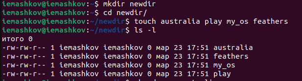
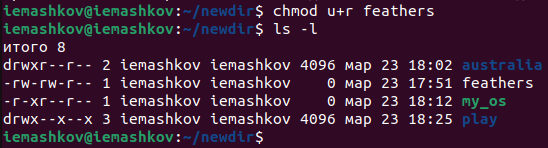
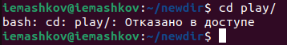

---
## Front matter
title: "Лабораторная работа №7"
subtitle: "Операционные системы"
author: "Машков Илья Евгеньевич"

## Generic otions
lang: ru-RU
toc-title: "Содержание"

## Bibliography
bibliography: bib/cite.bib
csl: pandoc/csl/gost-r-7-0-5-2008-numeric.csl

## Pdf output format
toc: true # Table of contents
toc-depth: 2
lof: true # List of figures
lot: true # List of tables
fontsize: 12pt
linestretch: 1.5
papersize: a4
documentclass: scrreprt
## I18n polyglossia
polyglossia-lang:
  name: russian
  options:
	- spelling=modern
	- babelshorthands=true
polyglossia-otherlangs:
  name: english
## I18n babel
babel-lang: russian
babel-otherlangs: english
## Fonts
mainfont: PT Serif
romanfont: PT Serif
sansfont: PT Sans
monofont: PT Mono
mainfontoptions: Ligatures=TeX
romanfontoptions: Ligatures=TeX
sansfontoptions: Ligatures=TeX,Scale=MatchLowercase
monofontoptions: Scale=MatchLowercase,Scale=0.9
## Biblatex
biblatex: true
biblio-style: "gost-numeric"
biblatexoptions:
  - parentracker=true
  - backend=biber
  - hyperref=auto
  - language=auto
  - autolang=other*
  - citestyle=gost-numeric
## Pandoc-crossref LaTeX customization
figureTitle: "Рис."
tableTitle: "Таблица"
listingTitle: "Листинг"
lofTitle: "Список иллюстраций"
lolTitle: "Листинги"
## Misc options
indent: true
header-includes:
  - \usepackage{indentfirst}
  - \usepackage{float} # keep figures where there are in the text
  - \floatplacement{figure}{H} # keep figures where there are in the text
---

# Цель работы

Ознакомление с файловой системой Linux, её структурой, именами и содержанием каталогов. Приобретение практических навыков по применению команд для работы с файлами и каталогами, по управлению процессами (и работами), по проверке использования диска и обслуживанию файловой системы.

# Задание

1. Выполните все примеры, приведённые в первой части описания лабораторной работы.
2. Выполните следующие действия, зафиксировав в отчёте по лабораторной работе используемые при этом команды и результаты их выполнения:
- 2.1. Скопируйте файл /usr/include/sys/io.h в домашний каталог и назовите его
equipment. Если файла io.h нет, то используйте любой другой файл в каталоге /usr/include/sys/ вместо него.
- 2.2. В домашнем каталоге создайте директорию ~/ski.plases.
- 2.3. Переместите файл equipment в каталог ~/ski.plases.
- 2.4. Переименуйте файл ~/ski.plases/equipment в ~/ski.plases/equiplist.
- 2.5. Создайте в домашнем каталоге файл abc1 и скопируйте его в каталог ~/ski.plases, назовите его equiplist2.
- 2.6. Создайте каталог с именем equipment в каталоге ~/ski.plases.
- 2.7. Переместите файлы ~/ski.plases/equiplist и equiplist2 в каталог ~/ski.plases/equipment.
- 2.8. Создайте и переместите каталог ~/newdir в каталог ~/ski.plases и назовите его plans.
3. Определите опции команды chmod, необходимые для того, чтобы присвоить перечисленным ниже файлам выделенные права доступа, считая, что в начале таких прав
нет:
- 3.1. drwxr--r-- ... australia
- 3.2. drwx--x--x ... play
- 3.3. -r-xr--r-- ... my_os
- 3.4. -rw-rw-r-- ... feathers
При необходимости создайте нужные файлы.
4. Проделайте приведённые ниже упражнения, записывая в отчёт по лабораторной работе используемые при этом команды:
- 4.1. Просмотрите содержимое файла /etc/password.
- 4.2. Скопируйте файл ~/feathers в файл ~/file.old.
- 4.3. Переместите файл ~/file.old в каталог ~/play.
- 4.4. Скопируйте каталог ~/play в каталог ~/fun.
- 4.5. Переместите каталог ~/fun в каталог ~/play и назовите его games.
- 4.6. Лишите владельца файла ~/feathers права на чтение.
- 4.7. Что произойдёт, если вы попытаетесь просмотреть файл ~/feathers командой cat?
- 4.8. Что произойдёт, если вы попытаетесь скопировать файл ~/feathers?
- 4.9. Дайте владельцу файла ~/feathers право на чтение.
- 4.10. Лишите владельца каталога ~/play права на выполнение.
- 4.11. Перейдите в каталог ~/play. Что произошло?
- 4.12. Дайте владельцу каталога ~/play право на выполнение.
5. Прочитайте man по командам mount, fsck, mkfs, kill и кратко их охарактеризуйте, приведя примеры.

# Выполнение лабораторной работы

## Копирование файлов и каталогов

### Копирование файлов

**1.** Создаю файл с именем **abc1** и копирую его уже с именем **may** и **april** (рис. [-@fig:001]).

{#fig:001 width=70%}

**2.** Создаю каталог **monthly** и переношу файлы **april** и **may** в него (рис. [-@fig:002]).

{#fig:002 width=70%}

**3.** Затем я в директории **monthly** копирую файл **may** в другой файл с именем **june** (рис. [-@fig:003]).

{#fig:003 width=70}

### Копирование каталогов

**1.** Копирую каталог **monthly** в каталог **monthly.00**, используя ключ **-r** для рекурсивного копирования (рис. [-@fig:004]).

{#fig:004 width=70%}

**2.** Затем копирую директорию **monthly.00** в каталог **tmp** (рис. [-@fig:005]).

{#fig:005 width=70%}

## Перемещение и переименование файлов и каталогов

### Перемещение и переименование файлов

**1.** Переименовываю файл **april** на **july** (рис. [-@fig:006]).

{#fig:006 width=70%}

**2.** Перемещаю файл **july** в каталог **monthly.00** (рис. [-@fig:007]).

{#fig:007 width=70%}

### Перемещение и переименование каталогов

**1.** Переименовываю каталог **monthly.00** на **monthly.01** (рис. [-@fig:008]).

{#fig:008 width=70%}

**2.** Создаю каталог **reports** и переношу в него директорию **monthly.01** (рис. [-@fig:009]).

{#fig:009 width=70%}

**3.** Находясь в домашней директории, переименовываю подкаталог директории **reports** **monthly.01** на **monthly** (рис. [-@fig:010]).

{#fig:010 width=70%}

## Изменение прав доступа

**1.** Файл с именем may у меня уже был создан, поэтому сразу даю право выполнения владельцу ключом **u+x** (рис. [-@fig:011]).

{#fig:011 width=70%}

**2.** Теперь отзываю эти права ключом **u-x** (рис. [-@fig:012]).

{#fig:012 width=70%}

**3.** Файл с именем **abc1** тоже уже был создан, поэтому сразу прехожу к присваиванию прав на запись для членов группы ключом **g+w** (рис. [-@fig:013]).
 
{#fig:013 width=70%}

## Список заданий

### 2. Команды cp и mv

**2.1.** Директории с именем **sys** у меня не было, как и файла **io.h**, поэтому я решил копировать файл **sg.h** в домашнюю директорию с именем **equpment** (рис. [-@fig:014]).

{#fig:014 width=70%}

**2.2.** В домашнем каталоге создаю директорию **ski-plases** (рис. [-@fig:015]):

{#fig:015 width=70%}

**2.3.** Далее перемещаю файл **equpment** в только что созданную директорию (рис. [-@fig:016]).

{#fig:016 width=70%}

**2.4.** Теперь переименовываю **equpment** в **equiplist** (рис. [-@fig:017]).

{#fig:017 width=70%}

**2.5.** Создаю файл с именем **abc1** и преношу его в **ski-plases** с изменением названия на **equiplist2** (рис. [-@fig:018]).

{#fig:018 width=70%}

**2.6.** Создаю каталог **equipment** в директории **ski-plases** (рис. [-@fig:019]).

{#fig:019 width=70%}

**2.7.** Перемещаю файлы **equiplist** и **equiplist2** в подкаталог **equipment** (рис. [-@fig:020]):

{#fig:020 width=70%}

**2.8.** Создаю каталог **newdir** и перемещаю его в директорию **ski-plases** со сменой его имени (рис. [-@fig:021]).

{#fig:021 width=70%}

### 3. Команда chmod

Решил создать отдельную папку для работы с правами доступа и уже в ней создать файлы с нужными именами (рис. [-@fig:022]).

{#fig:022 width=70%}

Правда, я потом понял, что **australia** и **play** должны быть каталогами (рис. [-@fig:023]).

{#fig:023 width=70%}

**3.1.** Решил начать с **australia**. Для нужного ключа доступа мне понадобились такие действия с командой **chmod** (рис. [-@fig:024]):

- **g=r--** - установка права на чтение членам группы;

- **u=r--** - установка права на чтение пользователю;

- **u=rwx** - установка права на чтение, изменение и выполнение только для пользователя;

- **o-x** - лишение прав на выполнение для всех остальных.  

{#fig:024 width=70%}

**3.2.** Далее работа с **play** (рис. [-@fig:025]):

- **g=x--** - установка права на выполнение членам группы;

- **u=x--** - установка права на выполнение пользователю;

- **g-r** - запрет на чтение членам группы;

- **o-r** - лишение прав на чтение для всех остальных. 

{#fig:025 width=70%}

**3.3.** Теперь работа с файлом **my_os** (рис. [-@fig:026]):

- **u-w** - лишение пользователя прав на запись;

- **g-w** - лишение членов группы прав на запись;

- **u+x** - присвоение пользователю прав на выполнение.

{#fig:026 width=70%}

**3.4.** Права для **feathers** были в норме, поэтому я их и не менял.

### 4. Работа с командами cp, mv и chmod

**4.1.** Просматриваю содержимое файла **passwd** (рис. [-@fig:027]).

{#fig:027 width=70%}

**4.2.** Копирую файл **feathers** в файл **file.old** (рис. [-@fig:028]):

{#fig:028 width=70%}

**4.3.** Перемещаю **file.old** в директорию **play** (рис. [-@fig:029]).

{#fig:029 width=70%}

**4.4.** Копирую каталог **play** в папку **fun** (рис. [-@fig:030]).

{#fig:030 width=70%}

**4.5.** Переношу каталог **fun** в директорию **play** с изменением имени на **games** (рис. [-@fig:031]).

{#fig:031 width=70%}

**4.6.** Лишаю владельца прав доступа на чтение файла **feathers** (рис. [-@fig:032]).

{#fig:032 width=70%}

**4.7.** Пробую просмотреть содержимое этого файла, но прав-то на это у меня нет, поэтому получаю ошибку (рис. [-@fig:033]):

{#fig:033 width=70%}

**4.8.** При попытке скопировать этот файл я получу ту же ошибку, т.к. я не могу читать, а соответственно и копировать, содржимое файлов (рис. [-@fig:034]). 

{#fig:034 width=70%}

**4.9.** Возращаю себе права на чтение (рис. [-@fig:035]).

{#fig:035 width=70%}

**4.10.** Лишаю себя прав на выполнение **play** (рис. [-@fig:036]).

{#fig:036 width=70%}

**4.11.** Переход в эту папку не произойдёт, т.к. я лишил себя прав на совершение действий с этим каталогом (рис. [-@fig:037]).

{#fig:037 width=70%}

**4.12.** Возвращаю себе права на выполнение (рис. [-@fig:038]):

{#fig:038 width=70%}

### 5. Команда man

Использую команду **man**, чтобы узнать информацию о командах **mount, fsck, mkfs, kill** (рис. [-@fig:039]). 

{#fig:039 width=70%}

- mount — утилита командной строки в UNIX-подобных операционных системах. Применяется для монтирования файловых систем.
- fsck (проверка файловой системы) - это утилита командной строки, которая позволяет выполнять проверки согласованности и интерактивное исправление в одной или нескольких файловых системах Linux. Он использует программы, специфичные для типа файловой системы, которую он проверяет.
- mkfs используется для создания файловой системы Linux на некотором устройстве, обычно в разделе жёсткого диска. В качестве аргумента filesys для файловой системы может выступать или название устройства
- Команда Kill посылает указанный сигнал указанному процессу. Если не указано ни одного сигнала, посылается сигнал SIGTERM. Сигнал SIGTERM завершает лишь те процессы, которые не обрабатывают его приход. Для других процессов может быть необходимым послать сигнал SIGKILL, поскольку этот сигнал перехватить невозможно.

# Ответы на контрольные вопросы

1. Дайте характеристику каждой файловой системе, существующей на жёстком диске компьютера, на котором вы выполняли лабораторную работу.

Ext2, Ext3, Ext4 или Extended Filesystem - это стандартная файловая система для Linux. Она была разработана еще для Minix. Она самая стабильная из всех существующих, кодовая база изменяется очень редко и эта файловая система содержит больше всего функций. Версия ext2 была разработана уже именно для Linux и получила много улучшений. В 2001 году вышла ext3, которая добавила еще больше стабильности благодаря использованию журналирования. В 2006 была выпущена версия ext4, которая используется во всех дистрибутивах Linux до сегодняшнего дня. В ней было внесено много улучшений, в том числе увеличен максимальный размер раздела до одного экзабайта.

Btrfs или B-Tree File System - это совершенно новая файловая система, которая сосредоточена на отказоустойчивости, легкости администрирования и восстановления данных. Файловая система объединяет в себе очень много новых интересных возможностей, таких как размещение на нескольких разделах, поддержка подтомов, изменение размера не лету, создание мгновенных снимков, а также высокая производительность. Но многими пользователями файловая система Btrfs считается нестабильной. Тем не менее, она уже используется как файловая система по умолчанию в OpenSUSE и SUSE Linux.

2. Приведите общую структуру файловой системы и дайте характеристику каждой директории первого уровня этой структуры.

/ — root каталог. Содержит в себе всю иерархию системы;

/bin — здесь находятся двоичные исполняемые файлы. Основные общие команды, хранящиеся отдельно от других программ в системе (прим.: pwd, ls, cat, ps);

/boot — тут расположены файлы, используемые для загрузки системы (образ initrd, ядро vmlinuz);

/dev — в данной директории располагаются файлы устройств (драйверов). С помощью этих файлов можно взаимодействовать с устройствами. К примеру, если это жесткий диск, можно подключить его к файловой системе. В файл принтера же можно написать напрямую и отправить задание на печать;

/etc — в этой директории находятся файлы конфигураций программ. Эти файлы позволяют настраивать системы, сервисы, скрипты системных демонов;

/home — каталог, аналогичный каталогу Users в Windows. Содержит домашние каталоги учетных записей пользователей (кроме root). При создании нового пользователя здесь создается одноименный каталог с аналогичным именем и хранит личные файлы этого пользователя;

/lib — содержит системные библиотеки, с которыми работают программы и модули ядра;

/lost+found — содержит файлы, восстановленные после сбоя работы системы. Система проведет проверку после сбоя и найденные файлы можно будет посмотреть в данном каталоге;

/media — точка монтирования внешних носителей. Например, когда вы вставляете диск в дисковод, он будет автоматически смонтирован в директорию /media/cdrom;

/mnt — точка временного монтирования. Файловые системы подключаемых устройств обычно монтируются в этот каталог для временного использования;

/opt — тут расположены дополнительные (необязательные) приложения. Такие программы обычно не подчиняются принятой иерархии и хранят свои файлы в одном подкаталоге (бинарные, библиотеки, конфигурации);

/proc — содержит файлы, хранящие информацию о запущенных процессах и о состоянии ядра ОС;

/root — директория, которая содержит файлы и личные настройки суперпользователя;

/run — содержит файлы состояния приложений. Например, PID-файлы или UNIX-сокеты;

/sbin — аналогично /bin содержит бинарные файлы. Утилиты нужны для настройки и администрирования системы суперпользователем;

/srv — содержит файлы сервисов, предоставляемых сервером (прим. FTP или Apache HTTP);

/sys — содержит данные непосредственно о системе. Тут можно узнать информацию о ядре, драйверах и устройствах;

/tmp — содержит временные файлы. Данные файлы доступны всем пользователям на чтение и запись. Стоит отметить, что данный каталог очищается при перезагрузке;

/usr — содержит пользовательские приложения и утилиты второго уровня, используемые пользователями, а не системой. Содержимое доступно только для чтения (кроме root). Каталог имеет вторичную иерархию и похож на корневой;

/var — содержит переменные файлы. Имеет подкаталоги, отвечающие за отдельные переменные. Например, логи будут храниться в /var/log, кэш в /var/cache, очереди заданий в /var/spool/ и так далее.

3. Какая операция должна быть выполнена, чтобы содержимое некоторой файловой системы было доступно операционной системе?

Монтирование тома.

4. Назовите основные причины нарушения целостности файловой системы. Как устранить повреждения файловой системы?

Отсутствие синхронизации между образом файловой системы в памяти и ее данными на диске в случае аварийного останова может привести к появлению следующих ошибок:

Один блок адресуется несколькими mode (принадлежит нескольким файлам).
Блок помечен как свободный, но в то же время занят (на него ссылается onode).
Блок помечен как занятый, но в то же время свободен (ни один inode на него не ссылается).
Неправильное число ссылок в inode (недостаток или избыток ссылающихся записей в каталогах).
Несовпадение между размером файла и суммарным размером адресуемых inode блоков.
Недопустимые адресуемые блоки (например, расположенные за пределами файловой системы).
"Потерянные" файлы (правильные inode, на которые не ссылаются записи каталогов).
Недопустимые или неразмещенные номера inode в записях каталогов.

5. Как создаётся файловая система? mkfs - позволяет создать файловую систему Linux.

6. Дайте характеристику командам для просмотра текстовых файлов.
Cat - выводит содержимое файла на стандартное устройство вывода. Выполнение команды head выведет первые 10 строк текстового файла. Выполнение команды tail выведет последние 10 строк текстового файла. Команда tac - это тоже самое, что и cat, только отображает строки в обратном порядке. Для того, чтобы просмотреть огромный текстовый файл применяются команды для постраничного просмотра. Такие как more и less.

7. Приведите основные возможности команды cp в Linux.
Cp – копирует или перемещает директорию, файлы.

8. Приведите основные возможности команды mv в Linux.
Mv - переименовать или переместить файл или директорию

9. Что такое права доступа? Как они могут быть изменены?
Права доступа к файлу или каталогу можно изменить, воспользовавшись командой chmod. Сделать это может владелец файла (или каталога) или пользователь с правами администратора.

# Выводы

В ходе выполнения лабораторной работы я ознакомился с файловой системой Linux, её структурой, именами и содержанием каталогов, а также приобрёл практические навыки по применению команд для работы с файлами и каталогами, по управлению процессами (и работами), по проверке использования диска и обслуживанию файловой системы.

# Список литературы{.unnumbered}

[Операционные системы](https://esystem.rudn.ru/pluginfile.php/2288087/mod_resource/content/4/005-lab_files.pdf)
