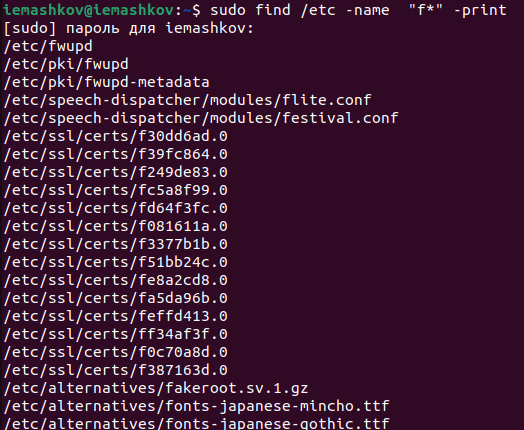

---
## Front matter
title: "Лабораторная работа №8"
subtitle: "Операционные системы"
author: "Машков Илья Евгеньевич"

## Generic otions
lang: ru-RU
toc-title: "Содержание"

## Bibliography
bibliography: bib/cite.bib
csl: pandoc/csl/gost-r-7-0-5-2008-numeric.csl

## Pdf output format
toc: true # Table of contents
toc-depth: 2
lof: true # List of figures
lot: true # List of tables
fontsize: 12pt
linestretch: 1.5
papersize: a4
documentclass: scrreprt
## I18n polyglossia
polyglossia-lang:
  name: russian
  options:
	- spelling=modern
	- babelshorthands=true
polyglossia-otherlangs:
  name: english
## I18n babel
babel-lang: russian
babel-otherlangs: english
## Fonts
mainfont: PT Serif
romanfont: PT Serif
sansfont: PT Sans
monofont: PT Mono
mainfontoptions: Ligatures=TeX
romanfontoptions: Ligatures=TeX
sansfontoptions: Ligatures=TeX,Scale=MatchLowercase
monofontoptions: Scale=MatchLowercase,Scale=0.9
## Biblatex
biblatex: true
biblio-style: "gost-numeric"
biblatexoptions:
  - parentracker=true
  - backend=biber
  - hyperref=auto
  - language=auto
  - autolang=other*
  - citestyle=gost-numeric
## Pandoc-crossref LaTeX customization
figureTitle: "Рис."
tableTitle: "Таблица"
listingTitle: "Листинг"
lofTitle: "Список иллюстраций"
lolTitle: "Листинги"
## Misc options
indent: true
header-includes:
  - \usepackage{indentfirst}
  - \usepackage{float} # keep figures where there are in the text
  - \floatplacement{figure}{H} # keep figures where there are in the text
---

# Цель работы

Ознакомление с инструментами поиска файлов и фильтрации текстовых данных. Приобретение практических навыков: по управлению процессами (и заданиями), по проверке использования диска и обслуживанию файловых систем.

# Задание

1. Осуществите вход в систему, используя соответствующее имя пользователя.
2. Запишите в файл file.txt названия файлов, содержащихся в каталоге /etc. Допишите в этот же файл названия файлов, содержащихся в вашем домашнем каталоге.
3. Выведите имена всех файлов из file.txt, имеющих расширение .conf, после чего запишите их в новый текстовой файл conf.txt.
4. Определите, какие файлы в вашем домашнем каталоге имеют имена, начинавшиеся с символа c? Предложите несколько вариантов, как это сделать.
5. Выведите на экран (по странично) имена файлов из каталога /etc, начинающиеся с символа h.
6. Запустите в фоновом режиме процесс, который будет записывать в файл ~/logfile файлы, имена которых начинаются с log.
7. Удалите файл ~/logfile.
8. Запустите из консоли в фоновом режиме редактор gedit.
9. Определите идентификатор процесса gedit, используя команду ps, конвейер и фильтр grep. Как ещё можно определить идентификатор процесса?
10. Прочтите справку (man) команды kill, после чего используйте её для завершения процесса gedit.
11. Выполните команды df и du, предварительно получив более подробную информацию об этих командах, с помощью команды man.
12. Воспользовавшись справкой команды find, выведите имена всех директорий, имеющихся в вашем домашнем каталоге.

# Выполнение лабораторной работы

1. Записываю в файл **file.txt** все названия из домашнего каталога и директории **/etc** с помощью команды **ls** с ключами **-lR** (рис. [-@fig:001]).

{#fig:001 width=70%}

2. Вывожу все имена файлов с расширением **.conf** из **file.txt** с помощью команды **grep** (рис. [-@fig:002]).

{#fig:002 width=70%}

Затем записываю эти имена в файл **conf.txt** и проверяю это командой **cat** (рис. [-@fig:003]).

{#fig:003 width=70}

3. С помощью команды **find** нахожу в домашней директории файлы, начинающиеся на **F** (рис. [-@fig:004]).

{#fig:004 width=70%}

Теперь делаю это с помощью команд **ls** и **grep** (рис. [-@fig:005]).

{#fig:005 width=70%}

4. Вывожу имена файлов из **/etc**, начинающихся на **log** (рис. [-@fig:006]).

{#fig:006 width=70%}

5. С помощью команды **find** запускаю фоновую запись всех названий файлов с именем на **log** в файл **logfile**, для этого ставлю **"&"** после названия файла (рис. [-@fig:007]).

{#fig:007 width=70%}

6. Затем удаляю **logfile** (рис. [-@fig:008]).

{#fig:008 width=70%}

7. Запускаю **gedit** в фоновом режиме, для этого прописываю знак амперсанта перед названием программы (рис. [-@fig:009]).

{#fig:009 width=70%}

8. Затем использую команду **ps**, конвейер и фильтр **grep** с соответствующими опциями для определения индентификатора запущенного процесса (рис. [-@fig:010]).

{#fig:010 width=70%}

9. Читаю справку по команде **kill**, после чего прописываю её с индентификатором процесса, выполнение которого я хочу прекратить (рис. [-@fig:011]).

{#fig:011 width=70%}

10. Читаю документацию по командам **df** и **du**, после чего выполняю эти команды (рис. [-@fig:012]).

{#fig:012 width=70%}

11. Воспользовавшись документацией, узнаю, что нужно использовать ключ **-type** с опцией **d** для команды **find**, чтобы вывести все названия каталогов из домашней директории (рис. [-@fig:013]).
 
{#fig:013 width=70%}

# Выводы

В ходе выполнения лабораторной работы я ознакомился с инструментами для поиска файлов и фильтрации текстовых данных. Также я приобрёл практические навыки по управлению процессами, по проверке использования диска и обслуживанию файловых систем.

# Список литературы{.unnumbered}

[Операционные системы](https://esystem.rudn.ru/pluginfile.php/2288089/mod_resource/content/4/006-lab_proc.pdf)
