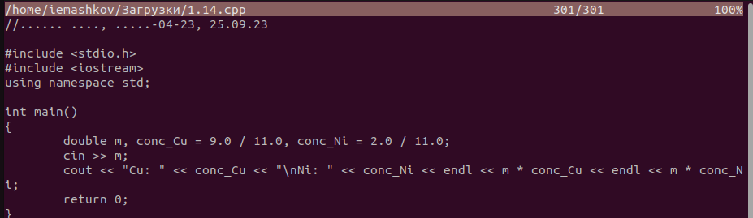

---
## Front matter
title: "Лабораторная работа №9"
subtitle: "Операционные системы"
author: "Машков Илья Евгеньевич"

## Generic otions
lang: ru-RU
toc-title: "Содержание"

## Bibliography
bibliography: bib/cite.bib
csl: pandoc/csl/gost-r-7-0-5-2008-numeric.csl

## Pdf output format
toc: true # Table of contents
toc-depth: 2
lof: true # List of figures
lot: true # List of tables
fontsize: 12pt
linestretch: 1.5
papersize: a4
documentclass: scrreprt
## I18n polyglossia
polyglossia-lang:
  name: russian
  options:
	- spelling=modern
	- babelshorthands=true
polyglossia-otherlangs:
  name: english
## I18n babel
babel-lang: russian
babel-otherlangs: english
## Fonts
mainfont: PT Serif
romanfont: PT Serif
sansfont: PT Sans
monofont: PT Mono
mainfontoptions: Ligatures=TeX
romanfontoptions: Ligatures=TeX
sansfontoptions: Ligatures=TeX,Scale=MatchLowercase
monofontoptions: Scale=MatchLowercase,Scale=0.9
## Biblatex
biblatex: true
biblio-style: "gost-numeric"
biblatexoptions:
  - parentracker=true
  - backend=biber
  - hyperref=auto
  - language=auto
  - autolang=other*
  - citestyle=gost-numeric
## Pandoc-crossref LaTeX customization
figureTitle: "Рис."
tableTitle: "Таблица"
listingTitle: "Листинг"
lofTitle: "Список иллюстраций"
lolTitle: "Листинги"
## Misc options
indent: true
header-includes:
  - \usepackage{indentfirst}
  - \usepackage{float} # keep figures where there are in the text
  - \floatplacement{figure}{H} # keep figures where there are in the text
---

# Цель работы

Освоение основных возможностей командной оболочки Midnight Commander. Приобретение навыков практической работы по просмотру каталогов и файлов; манипуляций с ними.

# Задание

1. Задание по mc
- Изучите информацию о mc, вызвав в командной строке man mc.
- Запустите из командной строки mc, изучите его структуру и меню.
- Выполните несколько операций в mc, используя управляющие клавиши (операции с панелями; выделение/отмена выделения файлов, копирование/перемещение файлов, получение информации о размере и правах доступа на файлы и/или каталоги и т.п.)
- Выполните основные команды меню левой (или правой) панели. Оцените степень подробности вывода информации о файлах.
- Используя возможности подменю Файл , выполните:

– просмотр содержимого текстового файла;

– редактирование содержимого текстового файла (без сохранения результатов редактирования);

– создание каталога;

– копирование в файлов в созданный каталог.

- С помощью соответствующих средств подменю Команда осуществите:

– поиск в файловой системе файла с заданными условиями (например, файла
с расширением .c или .cpp, содержащего строку main);

- Вызовите подменю Настройки . Освойте операции, определяющие структуру экрана mc (Full screen, Double Width, Show Hidden Files и т.д.).
2. Задание по встроенному редактору mc
- Создайте текстовой файл text.txt.
- Откройте этот файл с помощью встроенного в mc редактора.
- Вставьте в открытый файл небольшой фрагмент текста, скопированный из любого другого файла или Интернета.
- Проделайте с текстом следующие манипуляции, используя горячие клавиши:

2.4.1. Удалите строку текста.

2.4.2. Выделите фрагмент текста и скопируйте его на новую строку.

2.4.3. Выделите фрагмент текста и перенесите его на новую строку.

2.4.4. Сохраните файл.

2.4.5. Отмените последнее действие.

2.4.6. Перейдите в конец файла (нажав комбинацию клавиш) и напишите некоторый текст.

2.4.7. Перейдите в начало файла (нажав комбинацию клавиш) и напишите некоторый текст.

2.4.8. Сохраните и закройте файл.

- Откройте файл с исходным текстом на некотором языке программирования (например C или Java)
- Используя меню редактора, включите подсветку синтаксиса, если она не включена, или выключите, если она включена.

# Выполнение лабораторной работы

## Задание по mc

### Информация о mc

Использую команду **man** чтобы узнать информацию о команде **mc** (рис. [-@fig:001]).

{#fig:001 width=70%}

### Запуск mc

Запускаю **Midnight Commander** с помощью команды **mc** (рис. [-@fig:002]).

{#fig:002 width=70%}

### Выделение, копирование, перемещение, информация о файлах/каталогах в mc

Выделение файлов в **mc** происходит с помощью комбинации **Shift+up** (рис. [-@fig:003]).

{#fig:003 width=70}

Отменить выделение можно комбинацией **Shift+down** (рис. [-@fig:004]).

{#fig:004 width=70%}

Копирование файлов в **mc** осуществляется клавишей **F5** (рис. [-@fig:005]).

{#fig:005 width=70%}

Чтобы просмотреть информацию о файлах/каталогах необходимо вызвать подменю **"Правая(Левая) панель"** и выбрать пункт **"Информация"** (рис. [-@fig:006]).

{#fig:006 width=70%}

### Выполнение основных команд в меню правой или левой панели

В данном примере я выбрал пункт **"Древо"** и получил вывод древа каталогов (рис. [-@fig:007]).

{#fig:007 width=70%}

### Возможности подменю `Файл`

#### Просмотр содержимого файлов

Чтобы просмотреть содержимое файла используем клавишу **F3** (рис. [-@fig:008]).

{#fig:008 width=70%}

#### Редактирование файла

Чтобы редактировать файл используем клавишу **F4**, а чтобы выйти без сохранения мы нажимаем **Ctrl+x**, после чего не соглашаемся с принятием изменений (рис. [-@fig:009]).

{#fig:009 width=70%}

#### Создание каталога

Создание каталогов осуществляется клавишей **F7** (рис. [-@fig:010]).

{#fig:010 width=70%}

#### Копирование файлов в созданный каталог

Для этого используем **F5** и в путь прописываем адрес нашего каталога (рис. [-@fig:011]).

{#fig:011 width=70%}

### Возможности подменю `Команда`

#### Поиск файла с расширением .cpp

В открывшемся подменю используем опцию `Поиск`, а в открывшемся окне прописываем параметры для поиска (рис. [-@fig:012]).

{#fig:012 width=70%}

У меня таких файлов не оказалось (рис. [-@fig:013]).
 
{#fig:013 width=70%}

### Подменю `Настройки`

В этом подменю есть опция `Настройки панели`, где можно включить полноэкранное отображение, показ скрытых файлов и т.д. (рис. [-@fig:014]).

{#fig:014 width=70%}

## Задание по встроенному редактору mc

### Создание файла

С помощью команды **touch** создаю файл **text.txt** (рис. [-@fig:015]):

{#fig:015 width=70%}

### Редактирование text.txt в редакторе mc

Вставляю в файл часть описания заданий лабораторнорй работы (рис. [-@fig:016]).

{#fig:016 width=70%}

### Операции с горячими клавишами

#### Удаление строки текста

Удаляю строку **4.1.** комбинацией **Ctrl+y** (рис. [-@fig:017]).

{#fig:017 width=70%}

#### Копирование строки 

Выделяю строку **4.2.**, копирую её комбинацией **Ctrl+Shift+C** и вставляю её в конец комбинацией **Ctrl+U** (рис. [-@fig:018]).

{#fig:018 width=70%}

#### Перемещение строки 

Выделяю строку **4.3.** и вырезаю её комбинацией **Ctrl+K**, а потом вставляю её в конец комбинацией **Ctrl+U** (рис. [-@fig:019]).

{#fig:019 width=70%}

#### Сохранение файла

Сохранить содержимое файла можно как клавишей **F2**, так и комбинацией **Ctrl+O** (рис. [-@fig:020]):

{#fig:020 width=70%}

#### Отмена последних действий 

Отмену я производил комбинацией **Alt+U** (рис. [-@fig:021]).

{#fig:021 width=70%}

#### Остальные операции в редакторе

Перемещение в начало - клавиша **PageUp**.
Перемещение в конец - Клавиша **PadeDown**.
Выход из файла - клавиша **F10** или комбинация **Ctrl+X**.

### Открытие файла C++

Для этого я скачал файл со своего **github**.

### Включение/отключение подсветки синтаксиса

Изначально синтаксис подсвечен (рис. [-@fig:022]).

{#fig:022 width=70%}

Я не нашёл опции для отключение этой подсветки в меню редактора, а чтобы её отключить по-другому, надо прописывать команды, чего я делать не стал. Поэтому я просто открыл файл для обычного просмотра, в котором синтаксис не подсвечен (рис. [-@fig:023]).

{#fig:023 width=70%}

# Выводы

В ходе выполнения лабораторной работы я освоил основные возможности командной оболочки Midnight Commander. А также приобрёл навыки практической работы по просмотру каталогов и файлов, а также манипуляций с ними.

# Список литературы{.unnumbered}

[Операционные системы](https://esystem.rudn.ru/pluginfile.php/2288091/mod_resource/content/5/007-lab_mc.pdf)
