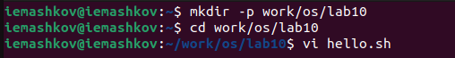
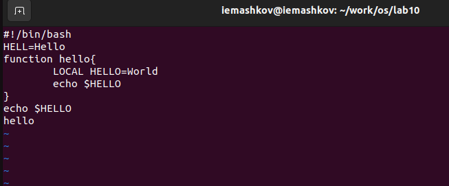
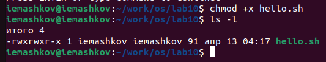
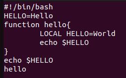
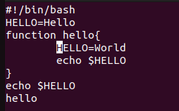
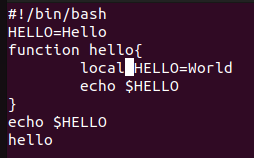
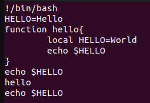
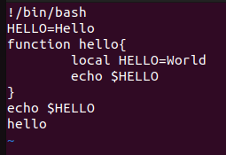
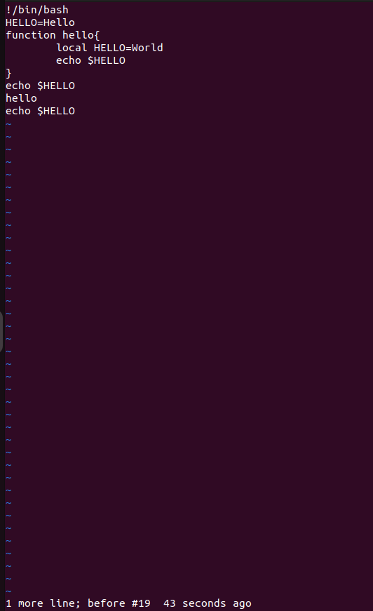
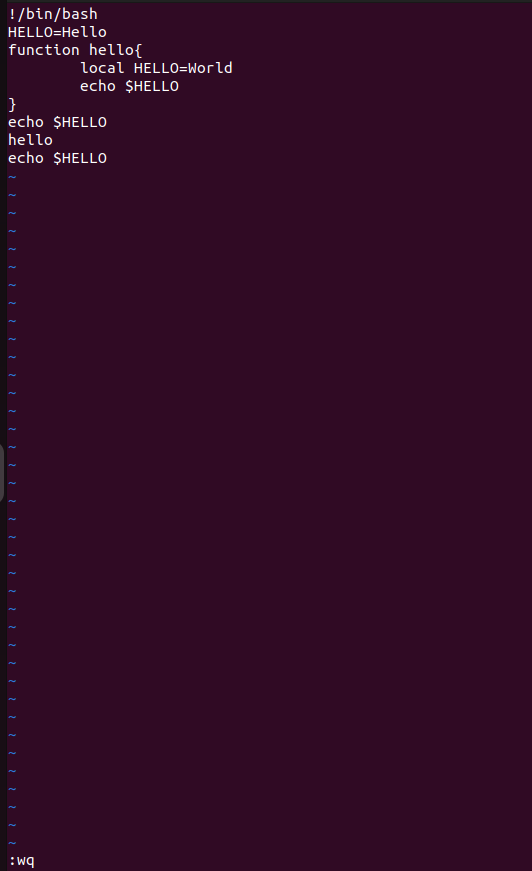

---
## Front matter
title: "Лабораторная работа №10"
subtitle: "Операционные системы"
author: "Машков Илья Евгеньевич"

## Generic otions
lang: ru-RU
toc-title: "Содержание"

## Bibliography
bibliography: bib/cite.bib
csl: pandoc/csl/gost-r-7-0-5-2008-numeric.csl

## Pdf output format
toc: true # Table of contents
toc-depth: 2
lof: true # List of figures
lot: true # List of tables
fontsize: 12pt
linestretch: 1.5
papersize: a4
documentclass: scrreprt
## I18n polyglossia
polyglossia-lang:
  name: russian
  options:
	- spelling=modern
	- babelshorthands=true
polyglossia-otherlangs:
  name: english
## I18n babel
babel-lang: russian
babel-otherlangs: english
## Fonts
mainfont: PT Serif
romanfont: PT Serif
sansfont: PT Sans
monofont: PT Mono
mainfontoptions: Ligatures=TeX
romanfontoptions: Ligatures=TeX
sansfontoptions: Ligatures=TeX,Scale=MatchLowercase
monofontoptions: Scale=MatchLowercase,Scale=0.9
## Biblatex
biblatex: true
biblio-style: "gost-numeric"
biblatexoptions:
  - parentracker=true
  - backend=biber
  - hyperref=auto
  - language=auto
  - autolang=other*
  - citestyle=gost-numeric
## Pandoc-crossref LaTeX customization
figureTitle: "Рис."
tableTitle: "Таблица"
listingTitle: "Листинг"
lofTitle: "Список иллюстраций"
lolTitle: "Листинги"
## Misc options
indent: true
header-includes:
  - \usepackage{indentfirst}
  - \usepackage{float} # keep figures where there are in the text
  - \floatplacement{figure}{H} # keep figures where there are in the text
---

# Цель работы

Познакомиться с операционной системой Linux. Получить практические навыки работы с редактором vi, установленным по умолчанию практически во всех дистрибутивах.

# Задание

1. Создание нового файла с использованием vi
2. Редактирование существующего файла.

# Выполнение лабораторной работы

## Редактирование нового файла

1. Создаю каталог и подкаталог с помощью команды **mkdir** с ключом **-p**, перехожу в неё командой **cd** и вызываю редактор **vi** с созданием файла **hello.sh** (рис. [-@fig:001]).

{#fig:001 width=70%}

2. Находясь в командном режиме, нажимаю клавишу **i**, чтобы перейти к редактированию файла (рис. [-@fig:002]).

{#fig:002 width=70%}

3. Перехожу в командный режим, нажимаю на знак двоеточия и прехожу в режим последней строки. Уже в этом режиме я прописываю команду **wq** **(w - запись, q - выход из файла)**.

4. С помощью команды **chmod** с ключом **+x** даю права на исполнение этого файла (рис. [-@fig:003]).

{#fig:003 width=70%}

## Редактирование существующего файла

1. В командном режиме использую комбинацию **2+G**, чтобы перейти ко второй строке, в которой меняю слово **HELL** на **HELLO** (рис. [-@fig:004]).

{#fig:004 width=70%}

2. Прожимаю комбинацию **4+G**, чтобы перейти к четвертой строке, где использую комбинацию **d+w**, чтобы удалить слово **LOCAL** (рис. [-@fig:005]).

{#fig:005 width=70%}

3. Затем нажимаю **А**, чтобы перейти в режим вставки, где прожимаю клавишу **i**, чтобы вставить строку перед курсором (рис. [-@fig:006]).

{#fig:006 width=70%}

4. С помощью клавиши **G** перехожу в конец файла, где также перехожу в режим вставки и добавляю строку под курсором клавишей **О** и пишу **echo $HELLO** (рис. [-@fig:007]).

{#fig:007 width=70%}

5. Удаляю последнюю строку командой **d+d** (рис. [-@fig:008]).

{#fig:008 width=70%}

6. Отменяю изменения клавишей **U** (рис. [-@fig:009]).

{#fig:009 width=70%}

7. Перехожу в режим последней строки и прописываю **wq**, чтобы записать изменения и выйти из файла (рис. [-@fig:010]).

{#fig:010 width=70%}

# Выводы

В ходе выполнения лабораторной работы я получил практические навыки работы с редактором vi, установленным по умолчанию практически во всех дистрибутивах Linux.

# Список литературы{.unnumbered}

[Операционные системы](https://esystem.rudn.ru/pluginfile.php/2288093/mod_resource/content/4/008-lab_vi.pdf)
