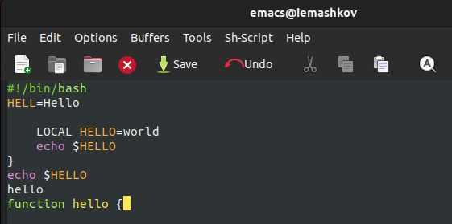
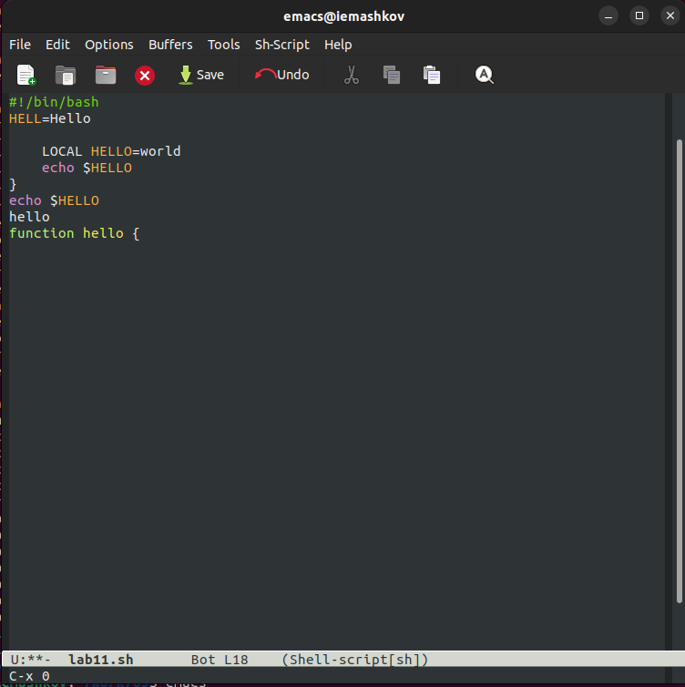

---
## Front matter
title: "Лабораторная работа №11"
subtitle: "Операционные системы"
author: "Машков Илья Евгеньевич"

## Generic otions
lang: ru-RU
toc-title: "Содержание"

## Bibliography
bibliography: bib/cite.bib
csl: pandoc/csl/gost-r-7-0-5-2008-numeric.csl

## Pdf output format
toc: true # Table of contents
toc-depth: 2
lof: true # List of figures
lot: true # List of tables
fontsize: 12pt
linestretch: 1.5
papersize: a4
documentclass: scrreprt
## I18n polyglossia
polyglossia-lang:
  name: russian
  options:
	- spelling=modern
	- babelshorthands=true
polyglossia-otherlangs:
  name: english
## I18n babel
babel-lang: russian
babel-otherlangs: english
## Fonts
mainfont: PT Serif
romanfont: PT Serif
sansfont: PT Sans
monofont: PT Mono
mainfontoptions: Ligatures=TeX
romanfontoptions: Ligatures=TeX
sansfontoptions: Ligatures=TeX,Scale=MatchLowercase
monofontoptions: Scale=MatchLowercase,Scale=0.9
## Biblatex
biblatex: true
biblio-style: "gost-numeric"
biblatexoptions:
  - parentracker=true
  - backend=biber
  - hyperref=auto
  - language=auto
  - autolang=other*
  - citestyle=gost-numeric
## Pandoc-crossref LaTeX customization
figureTitle: "Рис."
tableTitle: "Таблица"
listingTitle: "Листинг"
lofTitle: "Список иллюстраций"
lolTitle: "Листинги"
## Misc options
indent: true
header-includes:
  - \usepackage{indentfirst}
  - \usepackage{float} # keep figures where there are in the text
  - \floatplacement{figure}{H} # keep figures where there are in the text
---

# Цель работы

Познакомиться с операционной системой Linux. Получить практические навыки работы с редактором Emacs.

# Задание

1. Ознакомиться с теоретическим материалом.
2. Ознакомиться с редактором emacs.
3. Выполнить упражнения.
4. Ответить на контрольные вопросы.

# Теоретическое введение

**Определение 1.** Буфер — объект, представляющий какой-либо текст.
Буфер может содержать что угодно, например, результаты компиляции программы или встроенные подсказки. Практически всё взаимодействие с пользователем, в том числе интерактивное, происходит посредством буферов.

**Определение 2.** Фрейм соответствует окну в обычном понимании этого слова. Каждый фрейм содержит область вывода и одно или несколько окон Emacs.

**Определение 3.** Окно — прямоугольная область фрейма, отображающая один из буферов.

Каждое окно имеет свою строку состояния, в которой выводится следующая информация: название буфера, его основной режим, изменялся ли текст буфера и как далеко вниз по буферу расположен курсор. Каждый буфер находится только в одном из возможных основных режимов. Существующие основные режимы включают режим Fundamental (наименее специализированный), режим Text, режим Lisp, режим С, режим Texinfo и другие. Под второстепенными режимами понимается список режимов, которые включены в данный момент в буфере выбранного окна.

**Определение 4.** Область вывода — одна или несколько строк внизу фрейма, в которой Emacs выводит различные сообщения, а также запрашивает подтверждения и дополнительную информацию от пользователя.

**Определение 5.** Минибуфер используется для ввода дополнительной информации и всегда отображается в области вывода.

**Определение 6.** Точка вставки — место вставки (удаления) данных в буфере.

# Выполнение лабораторной работы

## Открытие emacs'а

Для начала я устанавливаю его, а потом прописываю в командной строке **emacs** (рис. [-@fig:001]).

{#fig:001 width=70%}

## Создание файла и его заполнение

Чтобы создать файл **lab11.sh**, мне потребовалось ввести комбинацию `Ctrl+x Ctrl+f`, а потом с клавиатуры ввести код (рис. [-@fig:002]).

{#fig:002 width=70%}

## Сохранение файла

Чтобы сохранить файл, нужно ввести комбинацию - `Ctrl+X Ctrl+S` (рис. [-@fig:003]).

{#fig:003 width=70}

## Редактирование файла

Чтобы вырезать строку целиком, нужно переместиться к этой строки и ввести комбинацию `Ctrl+K` (рис. [-@fig:004]).

{#fig:004 width=70%}

Чтобы вставить её в конец файла, небходимо использовать комбинацию `Ctrl+Y` (рис. [-@fig:005]).

{#fig:005 width=70%}

Для выделения области текста, нужно использовать `Ctrl+Space` (рис. [-@fig:006]).

{#fig:006 width=70%}

Копирование в буфер производится комбинацией `Alt+w`, а вставка - `Ctrl+Y` (рис. [-@fig:007]).

{#fig:007 width=70%}

Для вырезки выделенной области необходимо прожать `Ctrl+W` (рис. [-@fig:008]).

{#fig:008 width=70%}

Отмена последнего действия - `Ctrl+/` (рис. [-@fig:009]).

{#fig:009 width=70%}

## Перемещение курсора

Перемещение курсора в начало строки производится комбинацией `Ctrl+A` (рис. [-@fig:010]).

{#fig:010 width=70%}

А перемещение в конец строки - `Ctrl+E` (рис. [-@fig:011]).

{#fig:011 width=70%}

Перемещение курсора в начало строки в буфере - `Alt+<` (рис. [-@fig:012]).

{#fig:012 width=70%}

В конец - `Alt+>` (рис. [-@fig:013]).
 
{#fig:013 width=70%}

## Управление буферами

Для выведения списка активных буферов потребуется комбинация `Ctrl+x Ctrl+b` (рис. [-@fig:014]).

{#fig:014 width=70%}

Тут я должен был открыть другой буфер с помощью команды `Ctrl+X`, но открыл тот же самый (рис. [-@fig:015]):

{#fig:015 width=70%}

Закрываю окно буфера командой `Ctrl+X 0` (рис. [-@fig:016]).

{#fig:016 width=70%}

Чтобы переключаться между буферами, не используя список, нужно ввести команду `Ctrl+X b`, после чего ввести название буфера (рис. [-@fig:017]).

{#fig:017 width=70%}

## Управление окнами

Чтобы разделить окно на две части по вертикали, использую комбинацию `Ctrl+X 3` (рис. [-@fig:018]).

{#fig:018 width=70%}

По горизонтали - `Ctrl+X 2` (рис. [-@fig:019]).

{#fig:019 width=70%}

В каждом из четырёх окон ввожу текст (рис. [-@fig:020]):

{#fig:020 width=70%}

## Режим поиска 

Перехожу в режим поиска командой `Ctrl+S` и ищу слово **Enter** (рис. [-@fig:021]).

{#fig:021 width=70%}

Чтобы переключатся между результатами я нахожу слово **поиск** и нажимаю `Ctrl+S` всякий раз, когда хочу переключится (рис. [-@fig:022]).

{#fig:022 width=70%}

Переключаюсь на другой результат (рис. [-@fig:023]).

{#fig:023 width=70%}

Выхожу из режима комбинацией `Ctrl+G` (рис. [-@fig:024]).

{#fig:024 width=70%}

Перехожу в режим поска с заменой комбинацией `Alt+%` и ввожу слово **Enter** (рис. [-@fig:025]).

{#fig:025 width=70%}

И решаю заменить его на **Shift** (рис. [-@fig:026]).

{#fig:026 width=70%}

После чего нажимаю **!**, чтобы подтвердить замену (рис. [-@fig:027]).

{#fig:027 width=70%}

Решаю опробовать другой режим поска, для чего использую комбинацию `Alt+S 0` (рис. [-@fig:028]).

{#fig:028 width=70%}

Различие заключается в том, что это режим поска строки с введённым словом.

# Ответы на вопросы 

1. Кратко охарактеризуйте редактор emacs.

**Emacs — один из наиболее мощных и широко распространённых редакторов, используемых в мире UNIX. Написан на языке высокого уровня Lisp.**

2. Какие особенности данного редактора могут сделать его сложным для освоения новичком?

**Большое разнообразие сложных комбинаций клавиш, которые необходимы для редактирования файла и в принципе для работа с Emacs.**

3. Своими словами опишите, что такое буфер и окно в терминологии emacs’а.

**Буфер - это объект в виде текста. Окно - это прямоугольная область, в которой отображен буфер.**

4. Можно ли открыть больше 10 буферов в одном окне?

**Да, можно.**

5. Какие буферы создаются по умолчанию при запуске emacs?

**Emacs использует буферы с именами, начинающимися с пробела, для внутренних целей. Отчасти он обращается с буферами с такими именами особенным образом — например, по умолчанию в них не записывается информация для отмены изменений.**

6. Какие клавиши вы нажмёте, чтобы ввести следующую комбинацию C-c | и C-c C-|?

`Ctrl + c, а потом | и Ctrl + c Ctrl + |`

7. Как поделить текущее окно на две части?

**С помощью команды `Ctrl + x 3` (по вертикали) и `Ctrl + x 2` (по горизонтали).**

8. В каком файле хранятся настройки редактора emacs?

**Настройки emacs хранятся в файле . emacs, который хранится в домашней дирректории пользователя. Кроме этого файла есть ещё папка . emacs.**

9. Какую функцию выполняет клавиша **Backspace** и можно ли её переназначить?

**Выполняет функцию стереть, думаю можно переназначить.**

10. Какой редактор вам показался удобнее в работе vi или emacs? Поясните почему.

Мне больше понравился Emacs, потому что тут нет проблем с переключением между режимами. Т.е. у меня возникали проблемы по определению режима, в котором я нахожусь. В редакторе Vi нельзя перемещаться стрелочками и стирать что-либо бэкспейсом. Редактор Emacs является идеальной комбинацией текстового блокнота с командами из Vi. 

# Выводы

В ходе выполнения лабораторной работы я получил практические навыки работы с редактором Emacs. 

# Список литературы{.unnumbered}

[Операционные системы](https://esystem.rudn.ru/pluginfile.php/2288095/mod_resource/content/5/009-lab_emacs.pdf)
