---
## Front matter
title: "Лабораторная работа №13"
subtitle: "Операционные системы"
author: "Машков Илья Евгеньевич"

## Generic otions
lang: ru-RU
toc-title: "Содержание"

## Bibliography
bibliography: bib/cite.bib
csl: pandoc/csl/gost-r-7-0-5-2008-numeric.csl

## Pdf output format
toc: true # Table of contents
toc-depth: 2
lof: true # List of figures
lot: true # List of tables
fontsize: 12pt
linestretch: 1.5
papersize: a4
documentclass: scrreprt
## I18n polyglossia
polyglossia-lang:
  name: russian
  options:
	- spelling=modern
	- babelshorthands=true
polyglossia-otherlangs:
  name: english
## I18n babel
babel-lang: russian
babel-otherlangs: english
## Fonts
mainfont: PT Serif
romanfont: PT Serif
sansfont: PT Sans
monofont: PT Mono
mainfontoptions: Ligatures=TeX
romanfontoptions: Ligatures=TeX
sansfontoptions: Ligatures=TeX,Scale=MatchLowercase
monofontoptions: Scale=MatchLowercase,Scale=0.9
## Biblatex
biblatex: true
biblio-style: "gost-numeric"
biblatexoptions:
  - parentracker=true
  - backend=biber
  - hyperref=auto
  - language=auto
  - autolang=other*
  - citestyle=gost-numeric
## Pandoc-crossref LaTeX customization
figureTitle: "Рис."
tableTitle: "Таблица"
listingTitle: "Листинг"
lofTitle: "Список иллюстраций"
lolTitle: "Листинги"
## Misc options
indent: true
header-includes:
  - \usepackage{indentfirst}
  - \usepackage{float} # keep figures where there are in the text
  - \floatplacement{figure}{H} # keep figures where there are in the text
---

# Цель работы

Изучить основы программирования в оболочке ОС UNIX. Научится писать более сложные командные файлы с использованием логических управляющих конструкций и циклов.

# Задание

1. Используя команды getopts grep, написать командный файл, который анализирует командную строку с ключами:
- -iinputfile — прочитать данные из указанного файла;
- -ooutputfile — вывести данные в указанный файл;
- -pшаблон — указать шаблон для поиска;
- -C — различать большие и малые буквы;
- -n — выдавать номера строк.

а затем ищет в указанном файле нужные строки, определяемые ключом -p.

2. Написать на языке Си программу, которая вводит число и определяет, является ли оно больше нуля, меньше нуля или равно нулю. Затем программа завершается с помощью функции exit(n), передавая информацию в о коде завершения в оболочку. Командный файл должен вызывать эту программу и, проанализировав с помощью команды $?, выдать сообщение о том, какое число было введено.

3. Написать командный файл, создающий указанное число файлов, пронумерованных последовательно от 1 до N (например 1.tmp, 2.tmp, 3.tmp,4.tmp и т.д.). Число файлов, которые необходимо создать, передаётся в аргументы командной строки. Этот же командный файл должен уметь удалять все созданные им файлы (если они существуют).

4. Написать командный файл, который с помощью команды tar запаковывает в архив все файлы в указанной директории. Модифицировать его так, чтобы запаковывались только те файлы, которые были изменены менее недели тому назад (использовать команду find).

# Выполнение лабораторной работы

## 1-е задание

Создаю файлы **task1.sh**, **input.txt** и **output.txt**, затем в первом файле пишу программу, анализирующую текст в файле с расширением **".txt"** на наличие заданного пользователем слова и выводящую строки с этим текстом в отдельный файл (рис. [-@fig:001]).

```bash
#!/bin/bash

while getopts i:o:p:cn optletter
do
    case $optletter in
	i) i_flag=1; i_val=$OPTARG;;
	o) o_flag=1; o_val=$OPTARG;;
	p) p_flag=1; p_val=$OPTARG;;
	c) c_flag=1;;
	n) n_flag=1;;
	*) echo No such option as $optletter;;
    esac
done

if ! test $c_flag
then
    cf=-i
fi

if test $n_flag
then
    nf=-n
fi

grep $cf $nf $p_val $i_val >> $o_val
```

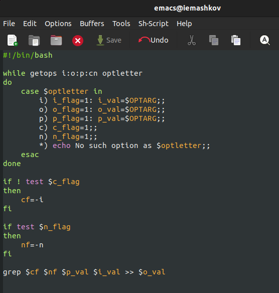{#fig:001 width=70%}

Затем запускаю данную программу, предварительно заполнив файл **input.txt** текстом песни группы Fun Mode - Паладин (рис. [-@fig:002]).

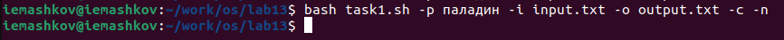{#fig:002 width=70%}

Затем проверяю результат, для чего открываю файл **output.txt** (рис. [-@fig:003]).

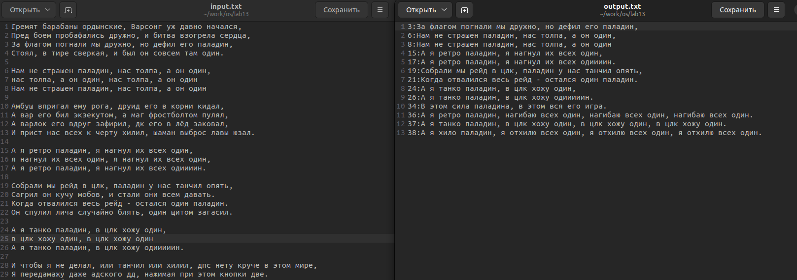{#fig:003 width=70%}

## 2-е задание

Создаю файл **task2.cpp** и **task2.sh**. В первом пишу программу на Cи, которая будет проверять введённое пользователем число на три критерия:

- >0;
- =0;
- <0.   

Выход из программы будет осуществляться функцией **exit(n)**, которая будет прописана в **.sh** файле (рис. [-@fig:004]).

```C
#include <stdlib.h>
#include <stdio.h>

int main(){
  int num;
  printf("Input the number: ");
  scanf("%d", &num);
  if (num > 0){
    exit(1);
  }
  else if (num = 0){
    exit(0);
  }
  else{
    exit(2);
  }
}
```

```bash
#!/bin/bash

gcc -o cprog task2.cpp
./cprog

case $? in
     0) echo "The number equals 0.";;
     1) echo "The number is more than 0.";;
     2) echo "The number less than 0.";;
esac
```

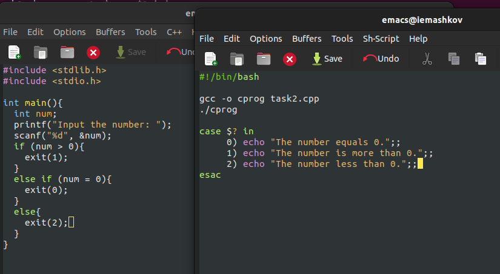{#fig:004 width=70%}

Запускаю программу и проверяю правильность её выполнения числами 7, 0 и -99 (рис. [-@fig:005]).

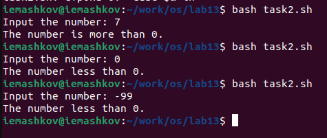{#fig:005 width=70%}

## 3-е задание

Создаю файл **task3.sh**, в котором пишу программу создающую файлы формата **"i".tmp**, где i может принять значения от 1 до ***N***. Программа должна создавать количество файлов, которое указывает пользователь, если таковых нет, а если они присутствуют, то удалять их (рис. [-@fig:006]).

```bash
#!/bin/bash

for ((i=1; i <= $*; i++))
do
    if test -f "$i".tmp
    then rm "$i".tmp
    else touch "$i.tmp"
    fi
done
```

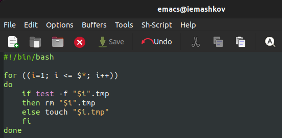{#fig:006 width=70%}

Запускаю программу со значением 5 и вижу, что создалось 5 файлов (рис. [-@fig:007]).

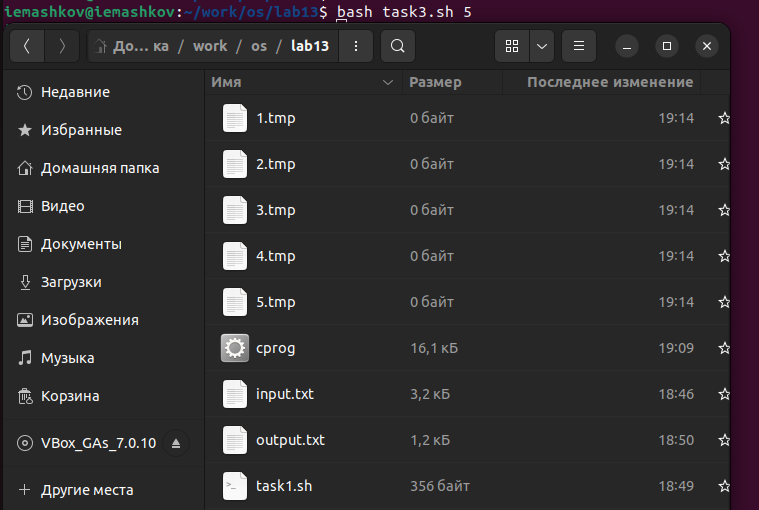{#fig:007 width=70%}

Затем запускаю опять, но со значением 6. В папке удалилось 5 файлов, т.к. они уже существовали, и появился 6-ой (рис. [-@fig:008]).

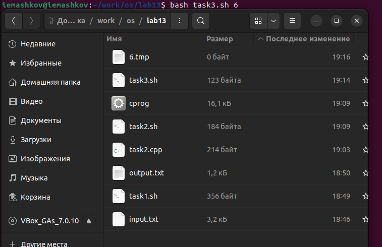{#fig:008 width=70%}

Теперь опять задаю значение 6, после чего удаляется 6-ой файл и создаются предыдущие 5, т.к. их не было в папке, а потом подаю значение 5, после чего всё удаляется (рис. [-@fig:009]).

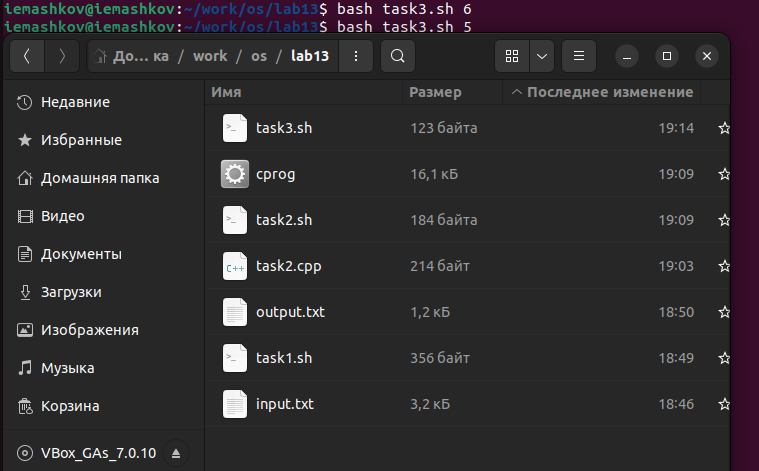{#fig:009 width=70%}

## 4-е задание

Создаю файл **task4.sh**, в котором пишу программу, которая в свою очередь архивирует все файлы, изменённые менее недели назад, и создаёт **FILES.txt**, в котором перечислены все названия заархивированных файлов (рис. [-@fig:010]).

```bash
#!/bin/bash

find $* -mtime -7 -mtime +0 -type f > FILES.txt
tar -cf archive.tar -T FILES.txt
```

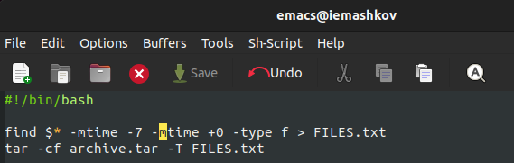{#fig:010 width=70%}

Затем запускаю программу, после чего в каталоге появляется архив и файл **FILES.txt** (рис. [-@fig:011]).

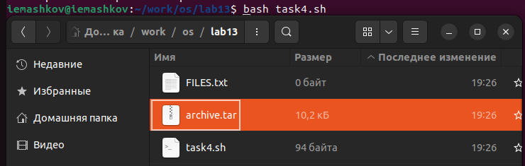{#fig:011 width=70%}

# Выводы

В процессе выполнения лабораторной работы я изучил основы программирования в оболочке ОС UNIX/Linux, а также научился писать более сложные командные файлы с использованием логических управляющих конструкций и циклов.

# Контрольные вопросы

1. Каково предназначение команды getopts?

**Осуществляет синтаксический анализ командной строки, выделяя флаги, и используется для объявления переменных. Синтаксис команды следующий: getopts option-string variable. Флаги – это опции командной строки, обычно помеченные знаком минус; Например, -F является флагом для команды ls -F. Иногда эти флаги имеют аргументы, связанные с ними. Программы интерпретируют эти флаги, соответствующим образом изменяя свое поведение. Строка опций option-string — это список возможных букв и чисел соответствующего флага. Если ожидается, что некоторый флаг будет сопровождаться некоторым аргументом, то за этой буквой должно следовать двоеточие. Соответствующей переменной присваивается буква данной опции. Если команда getopts может распознать аргумент, она возвращает истину. Принято включать getopts в цикл while и анализировать введенные данные с помощью оператора case. Предположим, необходимо распознать командную строку следующего формата:**

```bash
testprog -ifile_in.txt -ofile_out.doc -L -t -r 
```

**Вот как выглядит использование оператора getopts в этом случае:** 

```bash
while getopts o:i:Ltr optletter 
do 
  case $optletter in 
      o) oflag=1; oval=$OPTARG;; 
      i) iflag=1; ival=$OPTARG;; 
      L) Lflag=1;; 
      t) tflag=1;; 
      r) rflag=1;; 
      *) echo Illegal option $optletter 
  esac 
done 
```

**Функция getopts включает две специальные переменные среды – OPTARG и OPTIND. Если ожидается дополнительное значение, то OPTARG устанавливается в значение этого аргумента (будет равна file_in.txt для опции i и file_out.doc для опции o) . OPTIND является числовым индексом на упомянутый аргумент. Функция getopts также понимает переменные типа массив, следовательно, можно использовать ее в функции не только для синтаксического анализа аргументов функций, но и для анализа введенных пользователем данных.**

2. Какое отношение метасимволы имеют к генерации имён файлов?

**При перечислении имён файлов текущего каталога можно использовать следующие символы: − соответствует произвольной, в том числе и пустой строке; ? − соответствует любому одинарному символу; [c1-c2] − соответствует любому символу, лексикографически находящемуся между символами с1 и с2. Например, echo * − выведет имена всех файлов текущего каталога, что представляет собой простейший аналог команды ls; ls .c − выведет все файлы с последними двумя символами, совпадающими с .c. echo prog.? − выведет все файлы, состоящие из пяти или шести символов, первыми пятью символами которых являются prog.. [a-z] − соответствует произвольному имени файла в текущем каталоге, начинающемуся с любой строчной буквы латинского алфавита.**

3. Какие операторы управления действиями вы знаете?

**Часто бывает необходимо обеспечить проведение каких-либо действий циклически и управление дальнейшими действиями в зависимости отрезультатов проверки некоторого условия. Для решения подобных задач язык программирования bash предоставляет возможность использовать такие управляющие конструкции, как for, case, if и while. С точки зрения командного процессора эти управляющие конструкции являются обычными командами и могут использоваться как при создании командных файлов, так и при работе в интерактивном режиме. Команды, реализующие подобные конструкции, по сути, являются операторами языка программирования bash. Поэтому при описании языка программирования bash термин оператор будет использоваться наравне с термином команда. Команды ОС UNIX возвращают код завершения, значение которого может быть использовано для принятия решения о дальнейших действиях. Команда test, например, создана специально для использования в командных файлах. Единственная функция этой команды заключается в выработке кода завершения.**

4. Какие операторы используются для прерывания цикла?

**Два несложных способа позволяют вам прерывать циклы в оболочке bash. Команда break завершает выполнение цикла, а команда continue завершает данную итерацию блока операторов. Команда break полезна для завершения цикла while в ситуациях, когда условие перестаёт быть правильным. Команда continue используется в ситуациях, когда больше нет необходимости выполнять блок операторов, но вы можете захотеть продолжить проверять данный блок на других условных выражениях.**

5. Для чего нужны команды false и true?

**Следующие две команды ОС UNIX используются только совместно с управляющими конструкциями языка программирования bash: это команда true, которая всегда возвращает код завершения, равный нулю (т.е. истина), и команда false, которая всегда возвращает код завершения, не равный нулю (т. е. ложь).**

6. Что означает строка if test -f man$s/$i.$s, встреченная в командном файле?

**Строка 'if test -f man$s/$i.$s' проверяет, существует ли файл 'man$s/$i.$s' и является ли этот файл обычным файлом. Если данный файл является каталогом, то команда вернет нулевое значение (ложь).**

7. Объясните различия между конструкциями while и until.

**Выполнение оператора цикла while сводится к тому, что сначала выполняется последовательность команд (операторов), которую задаёт список-команд в строке, содержащей служебное слово while, а затем, если последняя выполненная команда из этой последовательности команд возвращает нулевой код завершения (истина), выполняется последовательность команд (операторов), которую задаёт список-команд в строке, содержащей служебное слово do, после чего осуществляется безусловный переход на начало оператора цикла while. Выход из цикла будет осуществлён тогда, когда последняя выполненная команда из последовательности команд (операторов), которую задаёт список-команд в строке, содержащей служебное слово while, возвратит ненулевой код завершения (ложь). При замене в  ператоре цикла while служебного слова while на until условие, при выполнении которого осуществляется выход из цикла, меняется на противоположное. В остальном оператор цикла while и оператор цикла until идентичны.**

# Список литературы{.unnumbered}

[Операционные системы](https://esystem.rudn.ru/pluginfile.php/2288099/mod_resource/content/5/011-lab_shell_prog_2.pdf)
