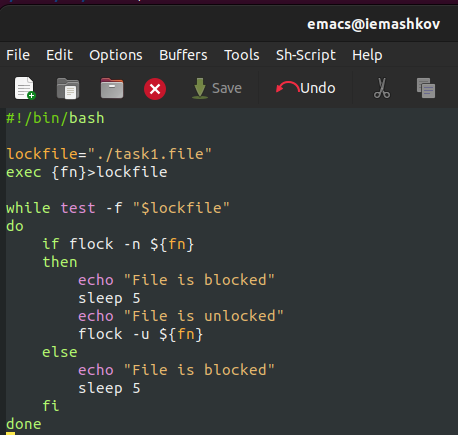
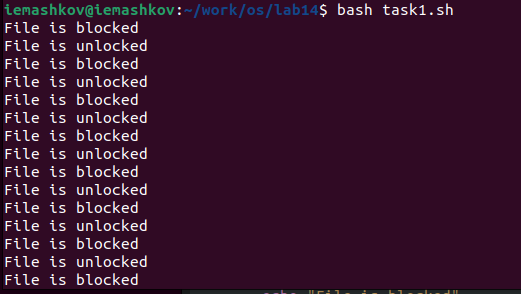
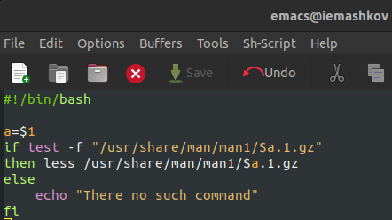
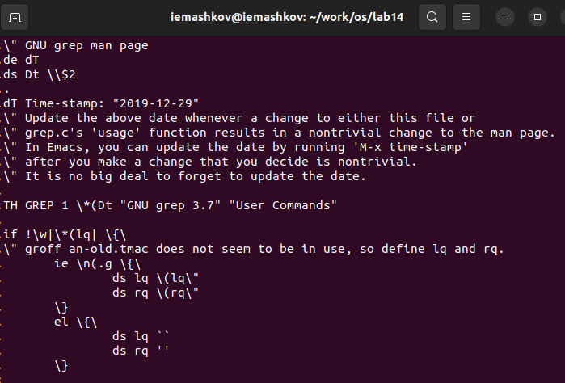
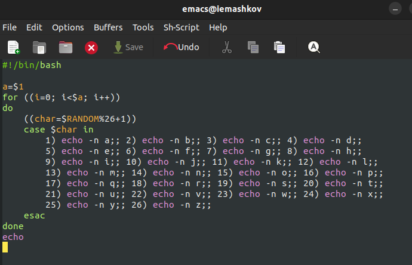
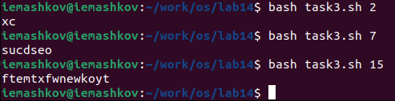

---
## Front matter
title: "Лабораторная работа №14"
subtitle: "Операционные системы"
author: "Машков Илья Евгеньевич"

## Generic otions
lang: ru-RU
toc-title: "Содержание"

## Bibliography
bibliography: bib/cite.bib
csl: pandoc/csl/gost-r-7-0-5-2008-numeric.csl

## Pdf output format
toc: true # Table of contents
toc-depth: 2
lof: true # List of figures
fontsize: 12pt
linestretch: 1.5
papersize: a4
documentclass: scrreprt
## I18n polyglossia
polyglossia-lang:
  name: russian
  options:
	- spelling=modern
	- babelshorthands=true
polyglossia-otherlangs:
  name: english
## I18n babel
babel-lang: russian
babel-otherlangs: english
## Fonts
mainfont: PT Serif
romanfont: PT Serif
sansfont: PT Sans
monofont: PT Mono
mainfontoptions: Ligatures=TeX
romanfontoptions: Ligatures=TeX
sansfontoptions: Ligatures=TeX,Scale=MatchLowercase
monofontoptions: Scale=MatchLowercase,Scale=0.9
## Biblatex
biblatex: true
biblio-style: "gost-numeric"
biblatexoptions:
  - parentracker=true
  - backend=biber
  - hyperref=auto
  - language=auto
  - autolang=other*
  - citestyle=gost-numeric
## Pandoc-crossref LaTeX customization
figureTitle: "Рис."
tableTitle: "Таблица"
listingTitle: "Листинг"
lofTitle: "Список иллюстраций"
lolTitle: "Листинги"
## Misc options
indent: true
header-includes:
  - \usepackage{indentfirst}
  - \usepackage{float} # keep figures where there are in the text
  - \floatplacement{figure}{H} # keep figures where there are in the text
---

# Цель работы

Научиться писать более сложные командные файлы с использованием логических управляющих конструкций и циклов.

# Задание

1. Написать командный файл, реализующий упрощённый механизм семафоров. Командный файл должен в течение некоторого времени t1 дожидаться освобождения ресурса, выдавая об этом сообщение, а дождавшись его освобождения, использовать его в течение некоторого времени t2<>t1, также выдавая информацию о том, что ресурс используется соответствующим командным файлом (процессом). Запустить командный файл в одном виртуальном терминале в фоновом режиме, перенаправив его вывод в другой (> /dev/tty#, где # — номер терминала куда перенаправляется вывод), в котором также запущен этот файл, но не фоновом, а в привилегированном режиме. Доработать программу так, чтобы имелась возможность взаимодействия трёх и более процессов.

2. Реализовать команду man с помощью командного файла. Изучите содержимое каталога /usr/share/man/man1. В нем находятся архивы текстовых файлов, содержащих справку по большинству установленных в системе программ и команд. Каждый архив можно открыть командой less сразу же просмотрев содержимое справки. Командный файл должен получать в виде аргумента командной строки название команды и в виде результата выдавать справку об этой команде или сообщение об отсутствии справки, если соответствующего файла нет в каталоге man1.

3. Используя встроенную переменную $RANDOM, напишите командный файл, генерирующий случайную последовательность букв латинского алфавита. Учтите, что $RANDOM выдаёт псевдослучайные числа в диапазоне от 0 до 32767.

# Выполнение лабораторной работы

## 1-е задание

Создаю файлы **task1.sh** и **task1.file**, затем в первом файле пишу программу, реализирующую упрощённый механизм семафоров (рис. [-@fig:001]).

```bash
#!/bin/bash

lockfile="./task1.file"
exec {fn}>lockfile

while test -f "$lockfile"
do
    if flock -n ${fn}
    then
	echo "File is blocked"
	sleep 5
	echo "File is unlocked"
	flock -u ${fn}
    else
	echo "File is blocked"
	sleep 5
    fi
done
```

{#fig:001 width=70%}

Затем запускаю данную программу и вижу, как повторяются одни и те же строчки с определённым временным промежутком (рис. [-@fig:002]).

{#fig:002 width=70%}

## 2-е задание

Теперь создаю файл **task2.sh** и прописываю в нём скрипт, который будет заменять команду **man** (рис. [-@fig:003]).

```bash
#!/bin/bash

a=$1
if test -f "/usr/share/man/man1/$a.1.gz"
then less /usr/share/man/man1/$a.1.gz
else
    echo "There no such command"
fi
```

{#fig:003 width=70%}

Запускаю программу со значением **grep** (рис. [-@fig:004]).

{#fig:004 width=70%}

В итоге получаю всю информацию о команде **grep** (рис. [-@fig:005]).

{#fig:005 width=70%}

## 3-е задание

Создаю файл **task3.sh**, в котором пишу рандомизатор, генерирующий последовательность из случайных букв латинского алфавита (рис. [-@fig:006]).

```bash
#!/bin/bash

a=$1
for ((i=0; i<$a; i++))
do
    ((char=$RANDOM%26+1))
    case $char in
	1) echo -n a;; 2) echo -n b;; 3) echo -n c;; 4) echo -n d;;
	5) echo -n e;; 6) echo -n f;; 7) echo -n g;; 8) echo -n h;;
	9) echo -n i;; 10) echo -n j;; 11) echo -n k;; 12) echo -n l;;
	13) echo -n m;; 14) echo -n n;; 15) echo -n o;; 16) echo -n p;;
	17) echo -n q;; 18) echo -n r;; 19) echo -n s;; 20) echo -n t;;
	21) echo -n u;; 22) echo -n v;; 23) echo -n w;; 24) echo -n x;;
	25) echo -n y;; 26) echo -n z;;
    esac
done
echo
```

{#fig:006 width=70%}

Затем запускаю этот файл, задавая ему разные значения: 2, 7, 15 (рис. [-@fig:007]).

{#fig:007 width=70%}

# Выводы

В процессе выполнения лабораторной работы я научился писать более сложные командные файлы с использованием логических управляющих конструкций и циклов.

# Контрольные вопросы

1. Найдите синтаксическую ошибку в следующей строке: 1 while [$1 != "exit"]

**В данной строчке допущены следующие ошибки: не хватает пробелов после первой скобки [и перед второй скобкой] выражение \$1 необходимо взять в “”, потому что эта переменная может содержать пробелы Таким образом, правильный вариант должен выглядеть так: while [“$1” != "exit"]**

2. Как объединить (конкатенация) несколько строк в одну?

**Чтобы объединить несколько строк в одну, можно воспользоваться несколькими способами: Первый: VAR1="Hello," VAR2=" World" VAR3="\$VAR1$VAR2" echo "\$VAR3" Результат: Hello, World Второй: VAR1="Hello, " VAR1+=" World" echo "\$VAR1" Результат: Hello, World**

3. Найдите информацию об утилите seq. Какими иными способами можно реализовать её функционал при программировании на bash?

**Команда seq в Linux используется для генерации чисел от ПЕРВОГО до ПОСЛЕДНЕГО шага INCREMENT. Параметры: seq LAST: если задан только один аргумент, он создает числа от 1 до LAST с шагом шага, равным 1. Если LAST меньше 1, значение is не выдает. seq FIRST LAST: когда заданы два аргумента, он генерирует числа от FIRST до LAST с шагом 1, равным 1. Если LAST меньше FIRST, он не выдает никаких выходных данных. seq FIRST INCREMENT LAST: когда заданы три аргумента, он генерирует числа от FIRST до LAST на шаге INCREMENT. Если LAST меньше, чем FIRST, он не производит вывод. seq -f «FORMAT» FIRST INCREMENT LAST: эта команда используется для генерации последовательности в форматированном виде. FIRST и INCREMENT являются необязательными. seq -s «STRING» ПЕРВЫЙ ВКЛЮЧЕНО: Эта команда используется для STRING для разделения чисел. По умолчанию это значение равно /n. FIRST и INCREMENT являются необязательными. seq -w FIRST INCREMENT LAST: эта команда используется для выравнивания ширины путем заполнения начальными нулями. FIRST и INCREMENT являются необязательными.**

4. Какой результат даст вычисление выражения \$((10/3))?

**Результатом данного выражения \$((10/3)) будет 3, потому что это целочисленное деление без остатка.**

5. Укажите кратко основные отличия командной оболочки zsh от bash.

**Отличия командной оболочки zsh от bash:**
 
- **В zsh более быстрое автодополнение для cd с помощью Тab В zsh существует калькулятор zcalc, способный выполнять вычисления внутри терминала.** 

- **В zsh поддерживаются числа с плавающей запятой В zsh поддерживаются структуры данных «хэш» В zsh поддерживается раскрытие полного пути на основенеполных данных.** 

- **В zsh поддерживается замена части пути.** 

- **В zsh есть возможность отображать разделенный экран, такой же как разделенный экран vim.**

6. Проверьте, верен ли синтаксис данной конструкции 1 for ((a=1; a <= LIMIT; a++))

**for ((a=1; a <= LIMIT; a++)) синтаксис данной конструкции верен, потому что, используя двойные круглые скобки, можно не писать $ перед переменными ().**

7. Сравните язык bash с какими-либо языками программирования. Какие преимущества у bash по сравнению с ними? Какие недостатки?

**Преимущества и недостатки скриптового языка bash:**

- **Удобное перенаправление ввода/вывода;**
- **Один из самых распространенных и ставится по умолчанию в большинстве дистрибутивах Linux, MacOS;**
- **Большое количество команд для работы с файловыми системами Linux;**
- **Можно писать собственные скрипты, упрощающие работу в Linux;**

**Недостатки скриптового языка bash:**

- **Дополнительные библиотеки других языков позволяют выполнить больше действий;**
- **Bash не является языком общего назначения.**


# Список литературы{.unnumbered}

[Операционные системы](https://esystem.rudn.ru/pluginfile.php/2288101/mod_resource/content/4/012-lab_shell_prog_3.pdf)
