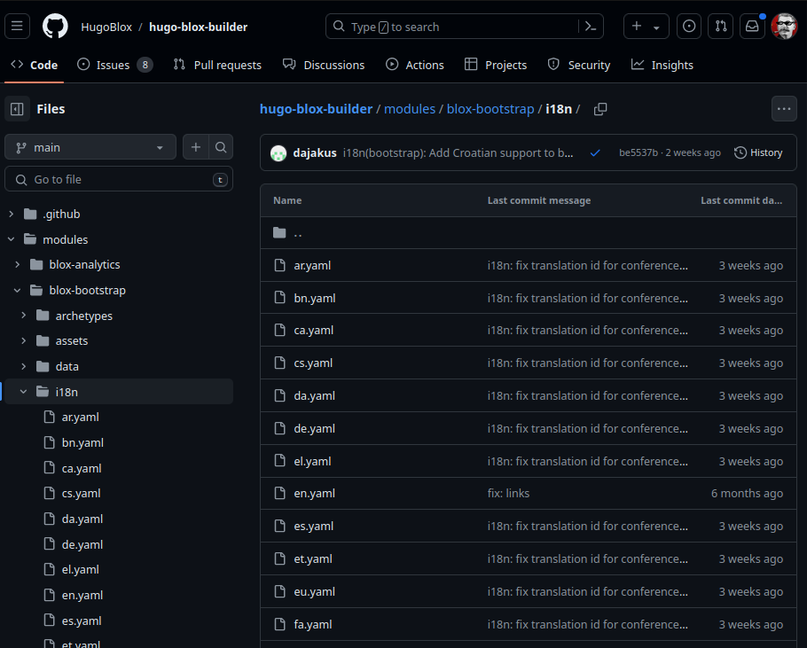
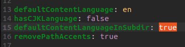
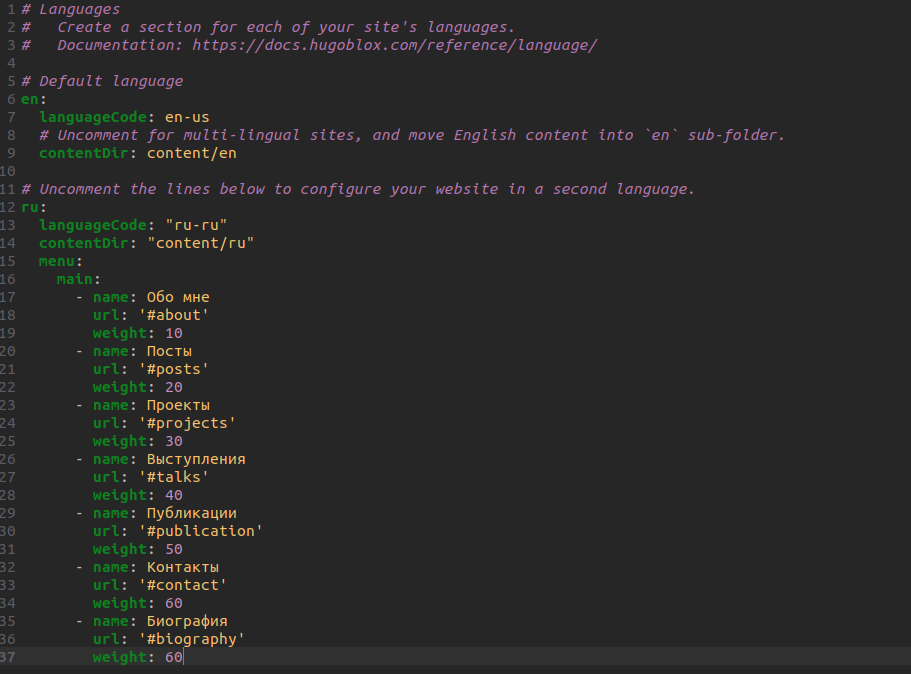
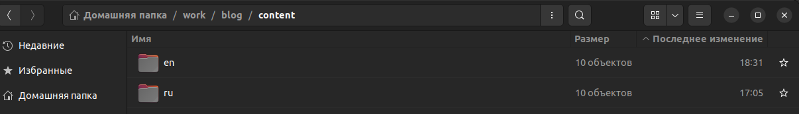
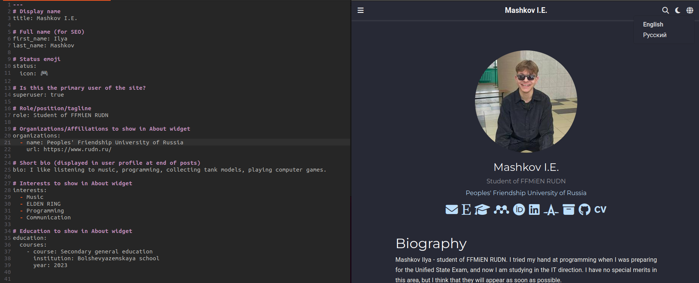
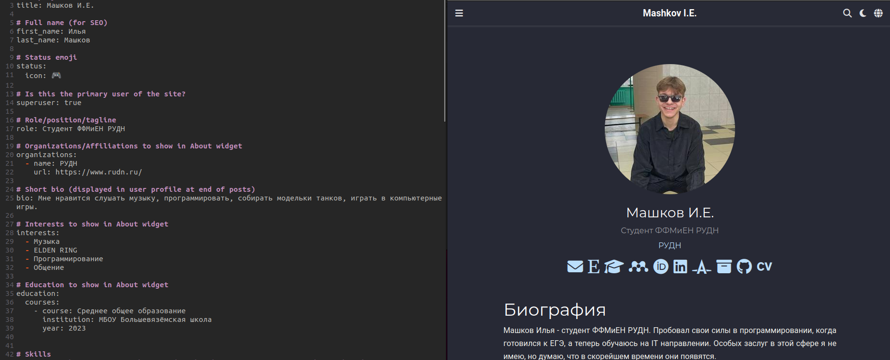

---
## Front matter
title: "Отчёт по индивидуальному проекту №6"
subtitle: "Операционные системы"
author: "Машков Илья Евгеньевич"

## Generic otions
lang: ru-RU
toc-title: "Содержание"

## Bibliography
bibliography: bib/cite.bib
csl: pandoc/csl/gost-r-7-0-5-2008-numeric.csl

## Pdf output format
toc: true # Table of contents
toc-depth: 2
lof: true # List of figures
fontsize: 12pt
linestretch: 1.5
papersize: a4
documentclass: scrreprt
## I18n polyglossia
polyglossia-lang:
  name: russian
  options:
	- spelling=modern
	- babelshorthands=true
polyglossia-otherlangs:
  name: english
## I18n babel
babel-lang: russian
babel-otherlangs: english
## Fonts
mainfont: PT Serif
romanfont: PT Serif
sansfont: PT Sans
monofont: PT Mono
mainfontoptions: Ligatures=TeX
romanfontoptions: Ligatures=TeX
sansfontoptions: Ligatures=TeX,Scale=MatchLowercase
monofontoptions: Scale=MatchLowercase,Scale=0.9
## Biblatex
biblatex: true
biblio-style: "gost-numeric"
biblatexoptions:
  - parentracker=true
  - backend=biber
  - hyperref=auto
  - language=auto
  - autolang=other*
  - citestyle=gost-numeric
## Pandoc-crossref LaTeX customization
figureTitle: "Рис."
tableTitle: "Таблица"
listingTitle: "Листинг"
lofTitle: "Список иллюстраций"
lolTitle: "Листинги"
## Misc options
indent: true
header-includes:
  - \usepackage{indentfirst}
  - \usepackage{float} # keep figures where there are in the text
  - \floatplacement{figure}{H} # keep figures where there are in the text
---

# Задание

1. Размещение двуязычного сайта на Github.

- Сделать поддержку английского и русского языков;
- Разместить элементы сайта на обоих языках;
- Разместить контент на обоих языках.

# Выполнение

## Создание поддержки английского и русского языков

Для начала мне понадобится скачать два файла с расширением **.yaml** с репозитория [HugoBlox](https://github.com/HugoBlox/hugo-blox-builder/tree/main/modules/blox-bootstrap/i18n) (рис. [-@fig:001]).

{#fig:001 width=70%}

Затем необходимо поменять параметр **defaultContentLanguageInSubdir** на **true** в файле **hugo.yaml** (рис. [-@fig:002]).

{#fig:002 width=70%}

Теперь перехожу в файл **languages.yaml** и создаю опцию для добавления русского языка, которая также может помочь в переводе некоторых слов в публикациях (рис. [-@fig:003]).

{#fig:003 width=70%}

Также создаю в папке **content** директории **ru** и **en** в которые перемещаю все папки и файлы, хранившиеся здесь до этого момента, и закидываю туда же файлы **en.yaml** и **ru.yaml** в соответствии с названием директории (рис. [-@fig:004]).

{#fig:004 width=70%}

## Размещение публикаций, проектов и т.д. на английском и русском языках

### Английский

В директории **en** превожу все посты и биографию на английский язык, после чего на самом сайте появляется иконка планетки, которая отвечает за смену языка (рис. [-@fig:005]).

{#fig:006 width=70%}

### Русский

В папке **ru** я переводил все элементы сайта, т.е. названия разделов и т.д. (рис. [-@fig:006]).

{#fig:006 width=70%}

# Выводы

За время выполнения всех этапов индивидуального проекта я научился создавать сайты по шаблону с помощью Hugo, а также добавлять двуязычный режим на них.

# Список литературы{.unnumbered}

1. [Операционные системы](https://esystem.rudn.ru/mod/page/view.php?id=1098777)

2. [Репозиторий HugoBlox](https://github.com/HugoBlox/hugo-blox-builder/tree/main)
